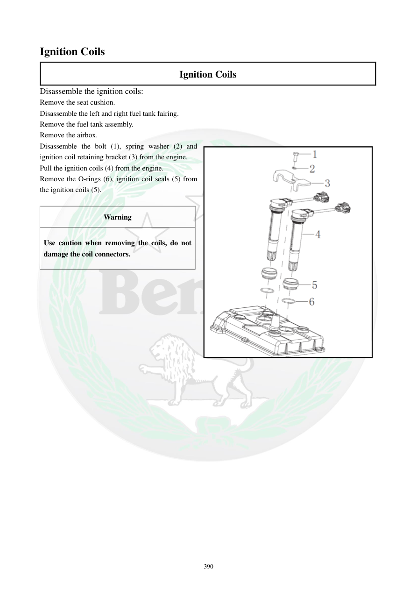

# Manual page 391

> Source: [page-0391.md](../source/page-0391.md)

## Page image / diagram

## Extracted text

# Source page 391

 
390 
Ignition Coils 
Ignition Coils 
Disassemble the ignition coils: 
Remove the seat cushion.  
Disassemble the left and right fuel tank fairing. 
Remove the fuel tank assembly.   
Remove the airbox. 
Disassemble the bolt (1), spring washer (2) and 
ignition coil retaining bracket (3) from the engine. 
Pull the ignition coils (4) from the engine. 
Remove the O-rings (6), ignition coil seals (5) from 
the ignition coils (5).  
 
Warning 
Use caution when removing the coils, do not 
damage the coil connectors.

## Persian notes

### باز کردن کویل‌های جرقه
1. صندلی را باز کنید.
2. قاب‌های کناری چپ و راست باک را باز کنید.
3. مجموعه باک را خارج کنید.
4. Airbox را باز کنید.
5. پیچ، واشر فنری و براکت نگهدارنده کویل را از موتور باز کنید.
6. کویل‌ها را از موتور بیرون بکشید.
7. O-ring و آب‌بندی کویل را از خود کویل جدا کنید.
- هنگام بیرون‌آوردن کویل‌ها مراقب کانکتورها باشید و به آن‌ها آسیب نزنید.
