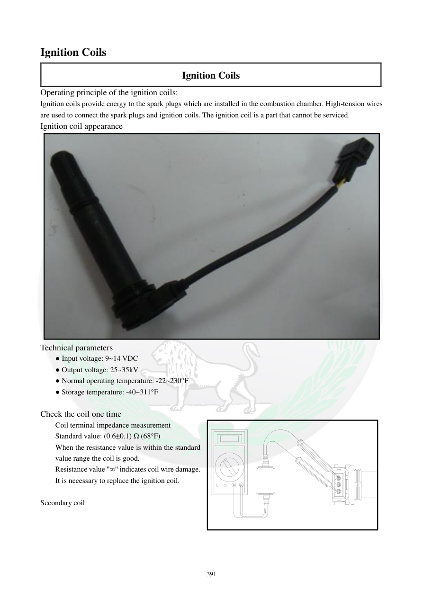

# Manual page 392

> Source: [page-0392.md](../source/page-0392.md)

## Page image / diagram

- [page-0392-img-01.jpeg](../images/embedded/page-0392-img-01.jpeg)

## Extracted text

# Source page 392

 
391 
Ignition Coils 
Ignition Coils 
Operating principle of the ignition coils: 
Ignition coils provide energy to the spark plugs which are installed in the combustion chamber. High-tension wires 
are used to connect the spark plugs and ignition coils. The ignition coil is a part that cannot be serviced.   
Ignition coil appearance 
 
Technical parameters 
● Input voltage: 9~14 VDC 
● Output voltage: 25~35kV 
● Normal operating temperature: -22~230°F 
● Storage temperature: -40~311°F 
 
Check the coil one time 
Coil terminal impedance measurement  
Standard value: (0.6±0.1) Ω (68°F) 
When the resistance value is within the standard 
value range the coil is good.  
Resistance value "∞" indicates coil wire damage. 
It is necessary to replace the ignition coil.  
 
Secondary coil

## Persian notes

<!-- Persian translation/explanation will be added here. -->
