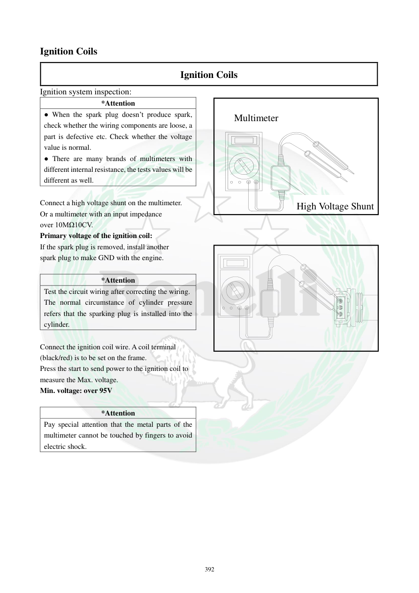

# Manual page 393

> Source: [page-0393.md](../source/page-0393.md)

## Page image / diagram

## Extracted text

# Source page 393

 
392 
Ignition Coils 
Ignition Coils 
Ignition system inspection: 
*Attention 
● When the spark plug doesn’t produce spark, 
check whether the wiring components are loose, a 
part is defective etc. Check whether the voltage 
value is normal.  
● There are many brands of multimeters with 
different internal resistance, the tests values will be 
different as well.  
 
Connect a high voltage shunt on the multimeter.  
Or a multimeter with an input impedance  
over 10MΩ10CV.  
Primary voltage of the ignition coil: 
If the spark plug is removed, install another  
spark plug to make GND with the engine.  
 
*Attention 
Test the circuit wiring after correcting the wiring.  
The normal circumstance of cylinder pressure 
refers that the sparking plug is installed into the 
cylinder.  
 
Connect the ignition coil wire. A coil terminal  
(black/red) is to be set on the frame.  
Press the start to send power to the ignition coil to  
measure the Max. voltage.  
Min. voltage: over 95V 
 
*Attention 
Pay special attention that the metal parts of the 
multimeter cannot be touched by fingers to avoid 
electric shock.  
 
 
高压分流器
万用表
High Voltage Shunt 
Multimeter

## Persian notes

### تست مدار اولیه کویل
- اگر شمع جرقه نمی‌زند، ابتدا شل‌بودن سیم‌ها/کانکتورها و سلامت قطعات و سپس ولتاژ مدار بررسی شود.
- برای اندازه‌گیری ولتاژ اولیه کویل، دفترچه استفاده از **High Voltage Shunt** یا مولتی‌متری با امپدانس ورودی بیش از **10 MΩ** را توصیه می‌کند.
- اگر شمع از سیلندر خارج شده، یک شمع دیگر برای ایجاد اتصال بدنه مناسب روی موتور نصب شود.
- سیم کویل متصل شود و ترمینال کویل با سیم **مشکی/قرمز** روی فریم قرار گیرد.
- با فشردن استارت، ولتاژ اولیه اندازه‌گیری شود؛ حداقل مقدار ذکرشده **بیش از 95 V** است.
- هنگام تست ولتاژ بالا، قسمت فلزی مولتی‌متر/تجهیزات را لمس نکنید.
