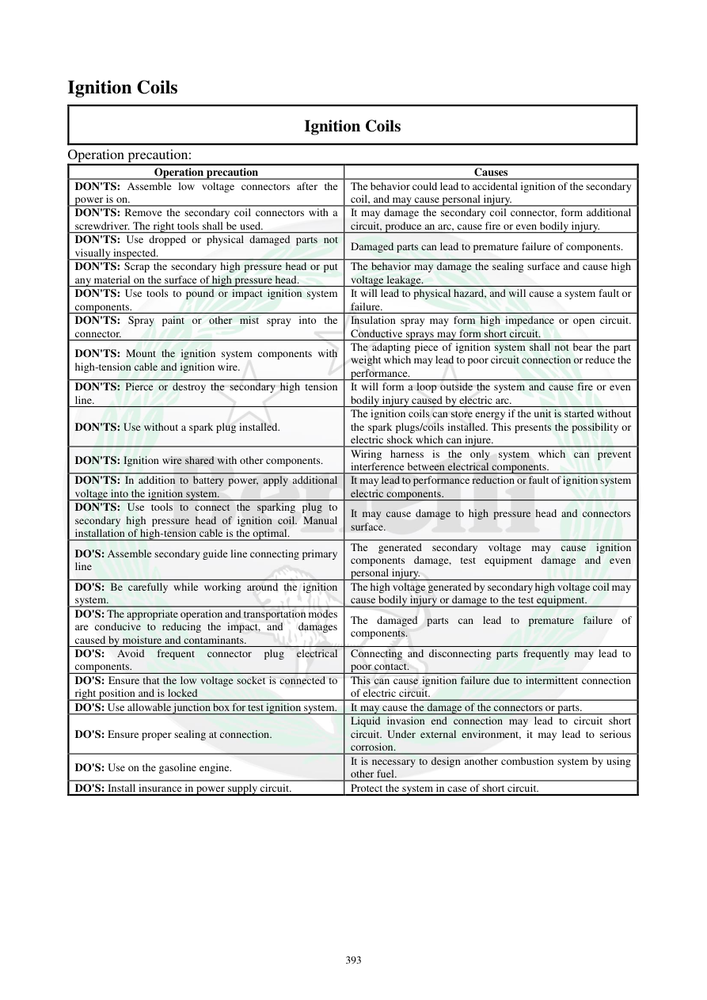

# Manual page 394

> Source: [page-0394.md](../source/page-0394.md)

## Page image / diagram

## Extracted text

# Source page 394

 
393 
Ignition Coils 
Ignition Coils 
Operation precaution: 
Operation precaution 
Causes 
DON'TS: Assemble low voltage connectors after the 
power is on.  
The behavior could lead to accidental ignition of the secondary 
coil, and may cause personal injury.  
DON'TS: Remove the secondary coil connectors with a 
screwdriver. The right tools shall be used.  
It may damage the secondary coil connector, form additional 
circuit, produce an arc, cause fire or even bodily injury.   
DON'TS: Use dropped or physical damaged parts not 
visually inspected.   
Damaged parts can lead to premature failure of components. 
DON'TS: Scrap the secondary high pressure head or put 
any material on the surface of high pressure head.   
The behavior may damage the sealing surface and cause high 
voltage leakage. 
DON'TS: Use tools to pound or impact ignition system 
components.  
It will lead to physical hazard, and will cause a system fault or 
failure.  
DON'TS: Spray paint or other mist spray into the 
connector.  
Insulation spray may form high impedance or open circuit. 
Conductive sprays may form short circuit.  
DON'TS: Mount the ignition system components with 
high-tension cable and ignition wire.  
The adapting piece of ignition system shall not bear the part 
weight which may lead to poor circuit connection or reduce the 
performance.  
DON'TS: Pierce or destroy the secondary high tension 
line.  
It will form a loop outside the system and cause fire or even 
bodily injury caused by electric arc. 
DON'TS: Use without a spark plug installed.  
The ignition coils can store energy if the unit is started without 
the spark plugs/coils installed. This presents the possibility or 
electric shock which can injure. 
DON'TS: Ignition wire shared with other components.  
Wiring harness is the only system which can prevent 
interference between electrical components. 
DON'TS: In addition to battery power, apply additional 
voltage into the ignition system.  
It may lead to performance reduction or fault of ignition system 
electric components. 
DON'TS: Use tools to connect the sparking plug to  
secondary high pressure head of ignition coil. Manual 
installation of high-tension cable is the optimal.  
It may cause damage to high pressure head and connectors 
surface.   
DO'S: Assemble secondary guide line connecting primary 
line 
The generated secondary voltage may cause ignition 
components damage, test equipment damage and even 
personal injury. 
DO'S: Be carefully while working around the ignition 
system.  
The high voltage generated by secondary high voltage coil may 
cause bodily injury or damage to the test equipment.  
DO'S: The appropriate operation and transportation modes 
are conducive to reducing the impact, and  damages 
caused by moisture and contaminants.  
The damaged parts can lead to premature failure of 
components.  
DO'S: 
Avoid 
frequent 
connector 
plug 
electrical 
components.  
Connecting and disconnecting parts frequently may lead to 
poor contact. 
DO'S: Ensure that the low voltage socket is connected to 
right position and is locked 
This can cause ignition failure due to intermittent connection 
of electric circuit. 
DO'S: Use allowable junction box for test ignition system.  It may cause the damage of the connectors or parts. 
DO'S: Ensure proper sealing at connection.  
Liquid invasion end connection may lead to circuit short 
circuit. Under external environment, it may lead to serious 
corrosion. 
DO'S: Use on the gasoline engine.  
It is necessary to design another combustion system by using 
other fuel.  
DO'S: Install insurance in power supply circuit.   
Protect the system in case of short circuit.

## Persian notes

<!-- Persian translation/explanation will be added here. -->
