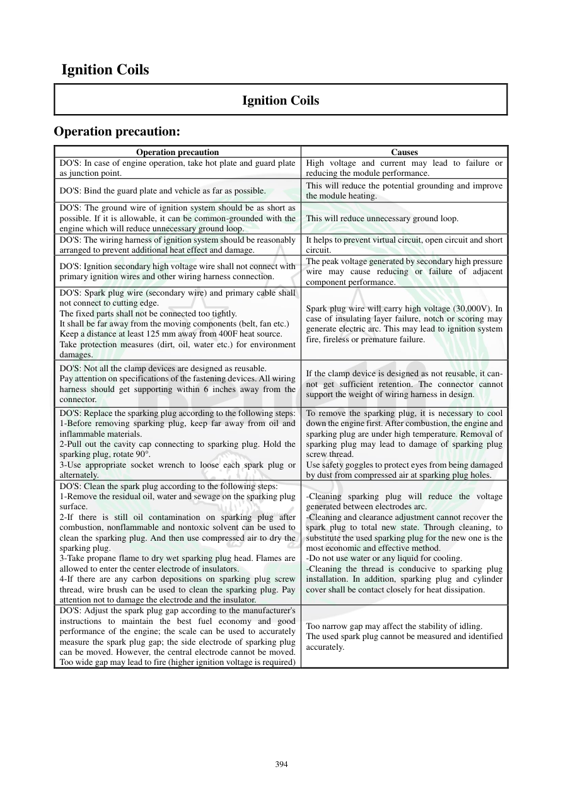

# Manual page 395

> Source: [page-0395.md](../source/page-0395.md)

## Page image / diagram

## Extracted text

# Source page 395

 
394 
 Ignition Coils 
Ignition Coils 
Operation precaution: 
Operation precaution 
Causes 
DO'S: In case of engine operation, take hot plate and guard plate 
as junction point.  
High voltage and current may lead to failure or 
reducing the module performance.  
DO'S: Bind the guard plate and vehicle as far as possible.  
This will reduce the potential grounding and improve 
the module heating. 
DO'S: The ground wire of ignition system should be as short as 
possible. If it is allowable, it can be common-grounded with the 
engine which will reduce unnecessary ground loop.   
This will reduce unnecessary ground loop.  
DO'S: The wiring harness of ignition system should be reasonably 
arranged to prevent additional heat effect and damage.  
It helps to prevent virtual circuit, open circuit and short 
circuit.  
DO'S: Ignition secondary high voltage wire shall not connect with 
primary ignition wires and other wiring harness connection.  
The peak voltage generated by secondary high pressure 
wire may cause reducing or failure of adjacent 
component performance. 
DO'S: Spark plug wire (secondary wire) and primary cable shall 
not connect to cutting edge.   
The fixed parts shall not be connected too tightly.  
It shall be far away from the moving components (belt, fan etc.) 
Keep a distance at least 125 mm away from 400F heat source.  
Take protection measures (dirt, oil, water etc.) for environment 
damages.  
Spark plug wire will carry high voltage (30,000V). In 
case of insulating layer failure, notch or scoring may 
generate electric arc. This may lead to ignition system 
fire, fireless or premature failure.  
DO'S: Not all the clamp devices are designed as reusable.  
Pay attention on specifications of the fastening devices. All wiring 
harness should get supporting within 6 inches away from the 
connector.  
If the clamp device is designed as not reusable, it can- 
not get sufficient retention. The connector cannot 
support the weight of wiring harness in design.  
DO'S: Replace the sparking plug according to the following steps: 
1-Before removing sparking plug, keep far away from oil and 
inflammable materials.  
2-Pull out the cavity cap connecting to sparking plug. Hold the 
sparking plug, rotate 90°.  
3-Use appropriate socket wrench to loose each spark plug or 
alternately.  
To remove the sparking plug, it is necessary to cool 
down the engine first. After combustion, the engine and 
sparking plug are under high temperature. Removal of 
sparking plug may lead to damage of sparking plug 
screw thread.  
Use safety goggles to protect eyes from being damaged 
by dust from compressed air at sparking plug holes.  
DO'S: Clean the spark plug according to the following steps: 
1-Remove the residual oil, water and sewage on the sparking plug 
surface.  
2-If there is still oil contamination on sparking plug after 
combustion, nonflammable and nontoxic solvent can be used to 
clean the sparking plug. And then use compressed air to dry the 
sparking plug.  
3-Take propane flame to dry wet sparking plug head. Flames are 
allowed to enter the center electrode of insulators.  
4-If there are any carbon depositions on sparking plug screw 
thread, wire brush can be used to clean the sparking plug. Pay 
attention not to damage the electrode and the insulator.  
-Cleaning sparking plug will reduce the voltage 
generated between electrodes arc.   
-Cleaning and clearance adjustment cannot recover the 
spark plug to total new state. Through cleaning, to 
substitute the used sparking plug for the new one is the 
most economic and effective method.   
-Do not use water or any liquid for cooling.  
-Cleaning the thread is conducive to sparking plug 
installation. In addition, sparking plug and cylinder 
cover shall be contact closely for heat dissipation.  
DO'S: Adjust the spark plug gap according to the manufacturer's 
instructions to maintain the best fuel economy and good 
performance of the engine; the scale can be used to accurately 
measure the spark plug gap; the side electrode of sparking plug 
can be moved. However, the central electrode cannot be moved. 
Too wide gap may lead to fire (higher ignition voltage is required) 
Too narrow gap may affect the stability of idling.  
The used spark plug cannot be measured and identified 
accurately.

## Persian notes

### نکات نصب، مسیر سیم‌ها و سرویس شمع
- سیم ولتاژ بالای ثانویه را از سیم‌های اولیه و دسته‌سیم‌های دیگر جدا نگه دارید.
- سیم‌ها را از لبه‌های تیز و قطعات متحرک دور کنید و از منابع حرارتی فاصله مناسب بدهید. متن دفترچه حداقل **125 mm از منبع حرارتی 400°F** را ذکر می‌کند.
- دسته‌سیم‌ها باید نزدیک کانکتورها مهار مناسب داشته باشند؛ همه بست‌ها لزوماً قابل استفاده مجدد نیستند.
- برای تعویض شمع، موتور ابتدا کاملاً خنک شود. اطراف شمع را از روغن و مواد قابل اشتعال پاک کنید و از ابزار مناسب استفاده کنید.
- برای تمیزکاری، روغن و آلودگی سطح شمع حذف شود. از آب برای خنک‌کردن شمع استفاده نکنید.
- برس سیمی فقط برای رسوب روی رزوه مجاز دانسته شده و نباید به الکترود یا عایق آسیب بزند.
- تمیزکردن شمع، آن را مثل شمع نو نمی‌کند؛ در شمع فرسوده، تعویض معمولاً راه‌حل مناسب‌تری است.
- فاصله دهانه شمع باید طبق مشخصات سازنده تنظیم شود. الکترود کناری قابل تنظیم است، اما الکترود مرکزی نباید خم شود.
- فاصله بیش از حد می‌تواند باعث نیاز به ولتاژ جرقه بالاتر و بدجرقه‌زدن شود؛ فاصله خیلی کم نیز می‌تواند پایداری دور آرام را مختل کند.
