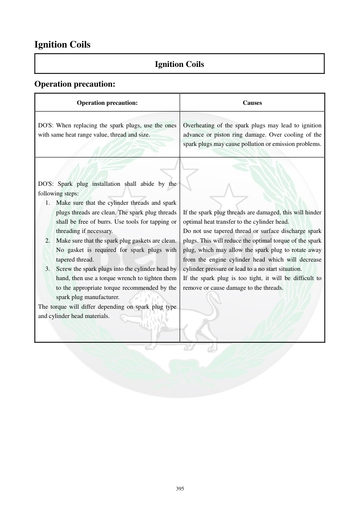

# Manual page 396

> Source: [page-0396.md](../source/page-0396.md)

## Page image / diagram

## Extracted text

# Source page 396

 
395 
Ignition Coils 
Ignition Coils 
Operation precaution: 
Operation precaution: 
Causes 
DO'S: When replacing the spark plugs, use the ones 
with same heat range value, thread and size.  
 
Overheating of the spark plugs may lead to ignition 
advance or piston ring damage. Over cooling of the 
spark plugs may cause pollution or emission problems. 
DO'S: Spark plug installation shall abide by the 
following steps: 
1. Make sure that the cylinder threads and spark 
plugs threads are clean. The spark plug threads 
shall be free of burrs. Use tools for tapping or 
threading if necessary.  
2. Make sure that the spark plug gaskets are clean. 
No gasket is required for spark plugs with 
tapered thread.  
3. Screw the spark plugs into the cylinder head by 
hand, then use a torque wrench to tighten them 
to the appropriate torque recommended by the 
spark plug manufacturer.   
The torque will differ depending on spark plug type 
and cylinder head materials. 
If the spark plug threads are damaged, this will hinder 
optimal heat transfer to the cylinder head.  
Do not use tapered thread or surface discharge spark 
plugs. This will reduce the optimal torque of the spark 
plug, which may allow the spark plug to rotate away 
from the engine cylinder head which will decrease 
cylinder pressure or lead to a no start situation.  
If the spark plug is too tight, it will be difficult to 
remove or cause damage to the threads.

## Persian notes

### انتخاب و نصب صحیح شمع
- شمع جایگزین باید همان **محدوده حرارتی، رزوه و ابعاد** شمع مورد تأیید موتور را داشته باشد.
- محدوده حرارتی نامناسب می‌تواند باعث مشکلاتی مانند پیش‌افتادن جرقه، آسیب رینگ پیستون، آلودگی و مشکلات آلایندگی شود.
- قبل از نصب، رزوه‌های سرسیلندر و شمع کاملاً تمیز و بدون پلیسه باشند.
- اگر شمع واشر آب‌بندی دارد، واشر تمیز باشد؛ برای شمع رزوه مخروطی واشر لازم نیست.
- ابتدا شمع را **با دست** داخل رزوه ببندید، سپس با ترک‌متر طبق گشتاور توصیه‌شده سازنده محکم کنید.
- گشتاور به نوع شمع و جنس سرسیلندر وابسته است.
- شمع بیش‌ازحد سفت می‌تواند بازکردن بعدی را دشوار کند یا به رزوه آسیب بزند.
- استفاده از رزوه مخروطی یا شمع Surface Discharge که برای این موتور تأیید نشده، توصیه نمی‌شود.
