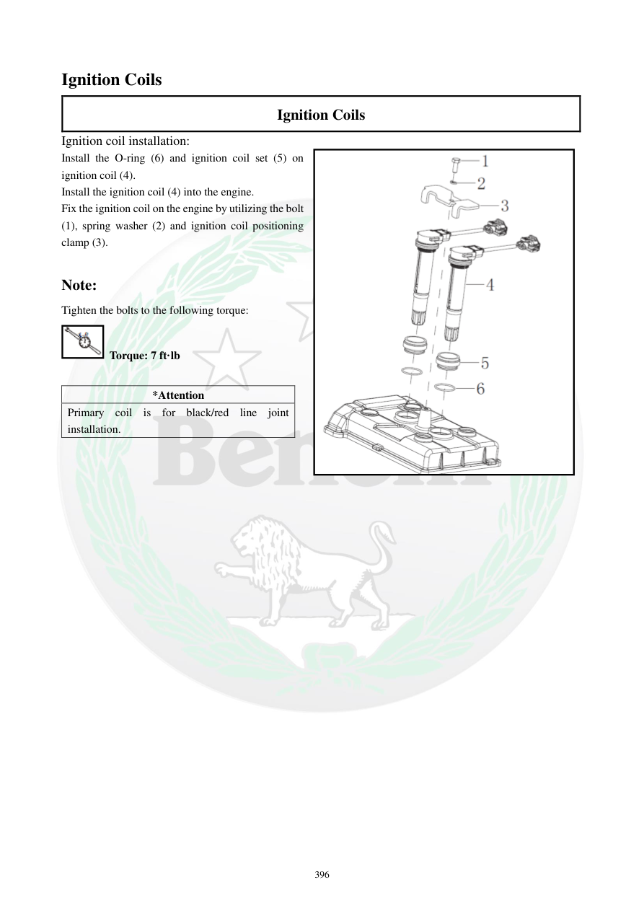

# Manual page 397

> Source: [page-0397.md](../source/page-0397.md)

## Page image / diagram

## Extracted text

# Source page 397

 
396 
Ignition Coils 
Ignition Coils 
Ignition coil installation: 
Install the O-ring (6) and ignition coil set (5) on 
ignition coil (4).  
Install the ignition coil (4) into the engine.  
Fix the ignition coil on the engine by utilizing the bolt 
(1), spring washer (2) and ignition coil positioning 
clamp (3).  
 
Note: 
Tighten the bolts to the following torque: 
 Torque: 7 ft·lb 
 
*Attention 
Primary coil is for black/red line joint 
installation.

## Persian notes

### نصب کویل جرقه
1. O-ring و آب‌بندی کویل را روی کویل نصب کنید.
2. کویل را داخل موتور قرار دهید.
3. کویل را با پیچ، واشر فنری و براکت موقعیت‌دهنده روی موتور ثابت کنید.
- گشتاور پیچ‌ها: **7 ft·lb**.
- کویل اولیه باید برای اتصال سیم **مشکی/قرمز** در محل مشخص‌شده نصب شود.
- برای جهت و جای دقیق O-ring، آب‌بندی و براکت، تصویر صفحه مرجع اصلی است.
