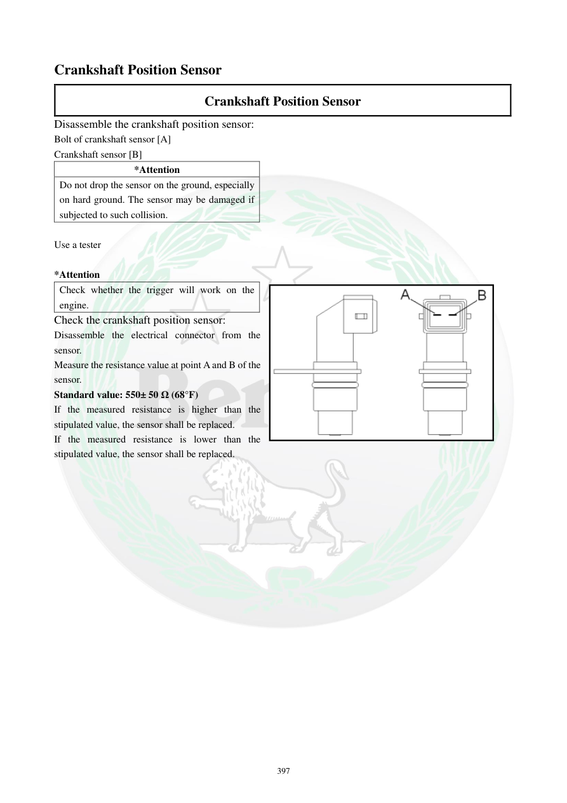

# Manual page 398

> Source: [page-0398.md](../source/page-0398.md)

## Page image / diagram

- [page-0398-img-01.png](../images/embedded/page-0398-img-01.png)

## Extracted text

# Source page 398

 
397 
Crankshaft Position Sensor 
Crankshaft Position Sensor 
Disassemble the crankshaft position sensor: 
Bolt of crankshaft sensor [A] 
Crankshaft sensor [B] 
*Attention 
Do not drop the sensor on the ground, especially 
on hard ground. The sensor may be damaged if 
subjected to such collision.  
 
Use a tester 
 
*Attention 
Check whether the trigger will work on the 
engine.  
Check the crankshaft position sensor: 
Disassemble the electrical connector from the 
sensor.  
Measure the resistance value at point A and B of the 
sensor.  
Standard value: 550± 50 Ω (68°F) 
If the measured resistance is higher than the 
stipulated value, the sensor shall be replaced.  
If the measured resistance is lower than the 
stipulated value, the sensor shall be replaced.

## Persian notes

### سنسور موقعیت میل‌لنگ (CKP)
- برای بازکردن، پیچ نگهدارنده و سنسور موقعیت میل‌لنگ را خارج کنید.
- سنسور را روی زمین نیندازید، مخصوصاً روی سطح سخت، چون ضربه می‌تواند آن را خراب کند.
- کانکتور سنسور را جدا کنید و مقاومت بین نقاط A و B را اندازه بگیرید.
- مقاومت استاندارد در حدود **20°C: 550 ± 50 Ω** است.
- بالاتر یا پایین‌تر بودن مقدار از محدوده مشخص‌شده، طبق دفترچه نشانه خرابی و نیاز به تعویض سنسور است.
- عملکرد Trigger نیز باید در شرایط نصب‌شده روی موتور بررسی شود.
