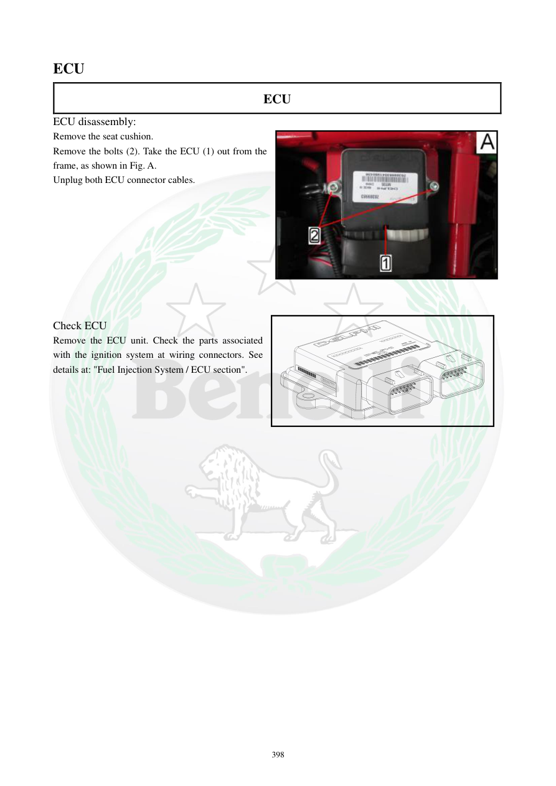

# Manual page 399

> Source: [page-0399.md](../source/page-0399.md)

## Page image / diagram

- [page-0399-img-01.jpeg](../images/embedded/page-0399-img-01.jpeg)

## Extracted text

# Source page 399

 
398 
ECU 
ECU 
ECU disassembly: 
Remove the seat cushion.  
Remove the bolts (2). Take the ECU (1) out from the 
frame, as shown in Fig. A. 
Unplug both ECU connector cables. 
 
 
 
 
 
 
 
 
 
Check ECU 
Remove the ECU unit. Check the parts associated 
with the ignition system at wiring connectors. See 
details at: "Fuel Injection System / ECU section".

## Persian notes

### باز کردن و بررسی ECU
- صندلی را باز کنید.
- پیچ‌های نگهدارنده را باز کرده و ECU را از فریم خارج کنید.
- هر دو کانکتور ECU را جدا کنید.
- برای بررسی ECU، ابتدا قطعات و اتصالات مرتبط با سیستم جرقه و دسته‌سیم‌ها کنترل شوند و سپس به بخش عیب‌یابی ECU/سیستم انژکتوری مراجعه شود.
- قبل از متهم‌کردن ECU به خرابی، تغذیه، بدنه و کانکتورها باید بررسی شوند.
