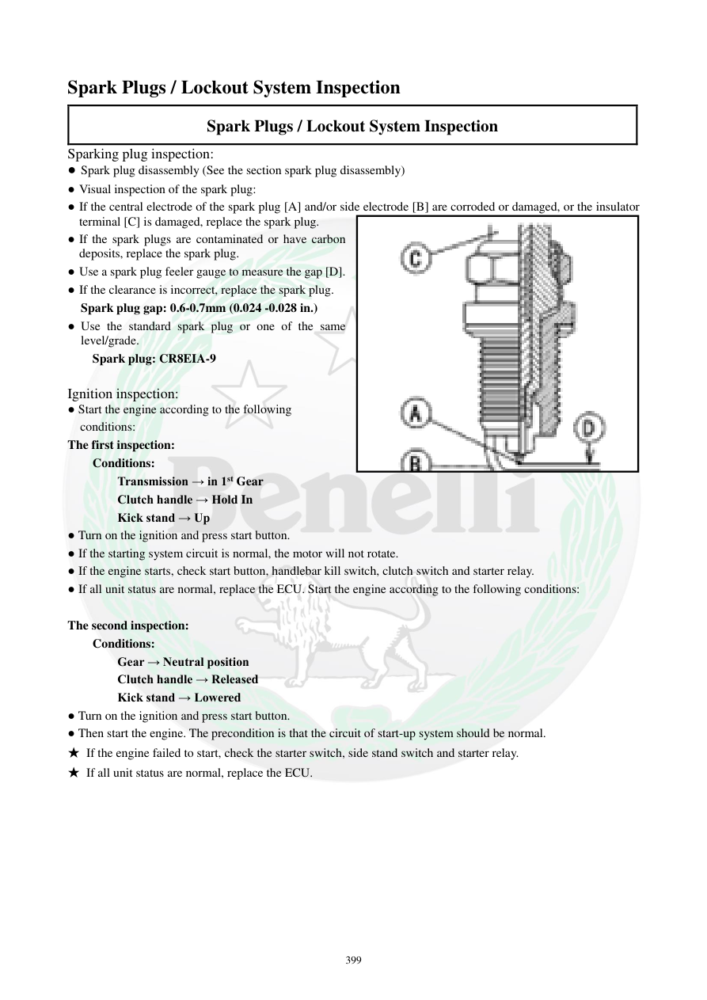

# Manual page 400

> Source: [page-0400.md](../source/page-0400.md)

## Page image / diagram

- [page-0400-img-01.png](../images/embedded/page-0400-img-01.png)

## Extracted text

# Source page 400

 
399 
Spark Plugs / Lockout System Inspection 
Spark Plugs / Lockout System Inspection 
Sparking plug inspection: 
● Spark plug disassembly (See the section spark plug disassembly)  
● Visual inspection of the spark plug: 
● If the central electrode of the spark plug [A] and/or side electrode [B] are corroded or damaged, or the insulator 
terminal [C] is damaged, replace the spark plug.  
● If the spark plugs are contaminated or have carbon 
deposits, replace the spark plug.  
● Use a spark plug feeler gauge to measure the gap [D].  
● If the clearance is incorrect, replace the spark plug.  
Spark plug gap: 0.6-0.7mm (0.024 -0.028 in.) 
● Use the standard spark plug or one of the same 
level/grade.  
Spark plug: CR8EIA-9 
 
Ignition inspection: 
● Start the engine according to the following                       
  conditions: 
The first inspection: 
Conditions: 
Transmission → in 1st Gear  
Clutch handle → Hold In 
Kick stand → Up 
● Turn on the ignition and press start button. 
● If the starting system circuit is normal, the motor will not rotate.  
● If the engine starts, check start button, handlebar kill switch, clutch switch and starter relay.  
● If all unit status are normal, replace the ECU. Start the engine according to the following conditions: 
 
The second inspection: 
Conditions: 
Gear → Neutral position 
Clutch handle → Released  
Kick stand → Lowered 
● Turn on the ignition and press start button.  
● Then start the engine. The precondition is that the circuit of start-up system should be normal.  
★ If the engine failed to start, check the starter switch, side stand switch and starter relay.  
★ If all unit status are normal, replace the ECU.

## Persian notes

### بررسی شمع و سیستم قفل ایمنی استارت
**شمع:**
- الکترود مرکزی یا جانبی خورده/آسیب‌دیده یا عایق خراب باشد، شمع تعویض شود.
- آلودگی یا دوده شدید نیز طبق دفترچه دلیل تعویض است.
- فاصله دهانه: **0.6 تا 0.7 mm**.
- شمع استاندارد ذکرشده: **CR8EIA-9**.

**تست اول مدار استارت:**
- دنده 1، کلاچ گرفته، جک بغل بالا.
- سوئیچ ON و دکمه استارت فشرده شود. در این وضعیت موتور نباید بچرخد.
- اگر موتور چرخید/روشن شد، دکمه استارت، کلید قطع‌کن روی فرمان، کلید کلاچ و رله استارت بررسی شوند.
- اگر همه این‌ها سالم باشند، دفترچه بررسی/تعویض ECU را مطرح می‌کند.

**تست دوم:**
- دنده خلاص، کلاچ رها، جک بغل پایین.
- با فشردن استارت موتور باید بتواند روشن شود.
- اگر روشن نشد، کلید استارت، کلید جک بغل و رله استارت بررسی شوند.
