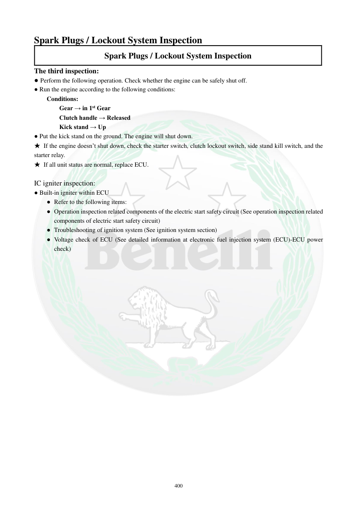

# Manual page 401

> Source: [page-0401.md](../source/page-0401.md)

## Page image / diagram

## Extracted text

# Source page 401

 
400 
Spark Plugs / Lockout System Inspection 
Spark Plugs / Lockout System Inspection 
The third inspection: 
● Perform the following operation. Check whether the engine can be safely shut off.  
● Run the engine according to the following conditions: 
Conditions: 
Gear → in 1st Gear 
Clutch handle → Released 
Kick stand → Up 
● Put the kick stand on the ground. The engine will shut down.  
★ If the engine doesn’t shut down, check the starter switch, clutch lockout switch, side stand kill switch, and the 
starter relay.  
★ If all unit status are normal, replace ECU.  
 
IC igniter inspection: 
● Built-in igniter within ECU 
● Refer to the following items: 
● Operation inspection related components of the electric start safety circuit (See operation inspection related 
components of electric start safety circuit)  
● Troubleshooting of ignition system (See ignition system section) 
● Voltage check of ECU (See detailed information at electronic fuel injection system (ECU)-ECU power 
check)

## Persian notes

<!-- Persian translation/explanation will be added here. -->
