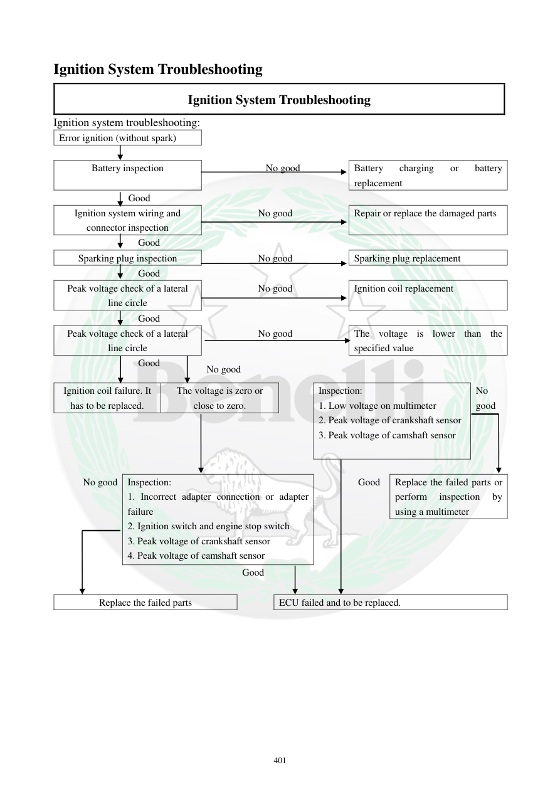

# Manual page 402

> Source: [page-0402.md](../source/page-0402.md)

## Page image / diagram

## Extracted text

# Source page 402

 
401 
Ignition System Troubleshooting 
Ignition System Troubleshooting 
Ignition system troubleshooting: 
Error ignition (without spark) 
 
 
 
 
 
Battery inspection 
  
 
 
No good 
 
Battery 
charging 
or 
battery 
replacement 
 
 
 
  Good 
 
 
Ignition system wiring and 
connector inspection 
No good 
Repair or replace the damaged parts 
 
 
 
 
Good 
 
 
Sparking plug inspection 
No good 
Sparking plug replacement 
 
 
 
 
Good 
 
 
Peak voltage check of a lateral 
line circle 
No good 
Ignition coil replacement 
 
 
 
 
Good 
 
 
Peak voltage check of a lateral 
line circle 
No good 
The voltage is lower than the 
specified value 
 
 
 
 
Good 
No good 
 
Ignition coil failure. It 
has to be replaced.  
The voltage is zero or 
close to zero. 
 
Inspection: 
1. Low voltage on multimeter 
2. Peak voltage of crankshaft sensor 
3. Peak voltage of camshaft sensor 
No 
good 
 
 
 
 
 
 
No good Inspection: 
1. Incorrect adapter connection or adapter 
failure 
2. Ignition switch and engine stop switch 
3. Peak voltage of crankshaft sensor 
4. Peak voltage of camshaft sensor 
Good 
 
Replace the failed parts or 
perform 
inspection 
by 
using a multimeter 
 
 
 
Good 
 
 
Replace the failed parts 
 
ECU failed and to be replaced.

## Persian notes

### عیب‌یابی سیستم جرقه، وقتی جرقه وجود ندارد
ترتیب منطقی عیب‌یابی طبق فلوچارت:
1. **باتری** را بررسی کنید؛ در صورت ضعیف بودن شارژ یا تعویض شود.
2. سیم‌کشی و کانکتورهای سیستم جرقه را بررسی و خرابی‌ها را تعمیر کنید.
3. **شمع** را بررسی و در صورت خرابی تعویض کنید.
4. ولتاژ پیک مدار/کویل جرقه را بررسی کنید.
5. اگر ولتاژ پیک خارج از محدوده بود، کویل بررسی و در صورت خرابی تعویض شود.
6. اگر ولتاژ صفر یا نزدیک صفر بود، آداپتور و نحوه اتصال، سوئیچ اصلی و کلید قطع موتور، سنسور موقعیت میل‌لنگ و سنسور میل‌سوپاپ بررسی شوند.
7. پس از بررسی این موارد، اگر مدارها و قطعات مرتبط سالم باشند، ECU به‌عنوان آخرین مرحله بررسی و در صورت تأیید خرابی تعویض می‌شود.
- متن OCR فلوچارت در چند نقطه عبارت «peak voltage of a lateral line circle» را تکرار کرده؛ برای مسیر دقیق هر اندازه‌گیری، **تصویر فلوچارت صفحه مرجع اصلی است**.
