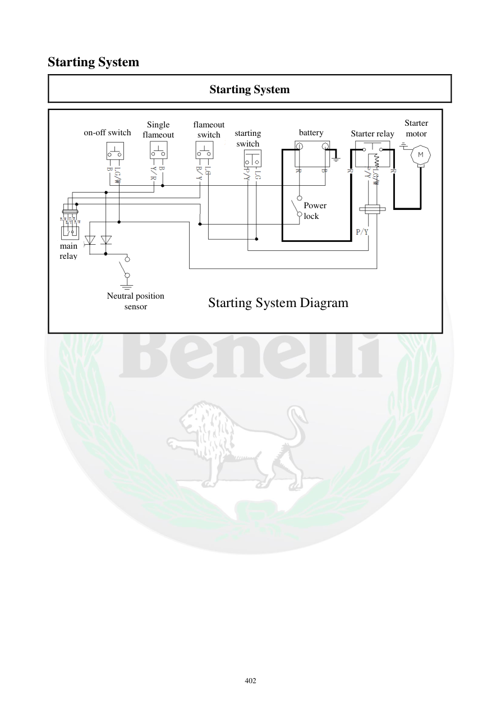

# Manual page 403

> Source: [page-0403.md](../source/page-0403.md)

## Page image / diagram

- [page-0403-img-01.png](../images/embedded/page-0403-img-01.png)

## Extracted text

# Source page 403

 
402 
Starting System 
Starting System 
 
 
 
 
 
 
on-off switch 
Single 
flameout 
flameout 
switch 
starting 
switch 
battery 
Starter relay 
Starter 
motor 
main 
relay 
Neutral position 
sensor 
Power 
lock 
Starting System Diagram

## Persian notes

<!-- Persian translation/explanation will be added here. -->
