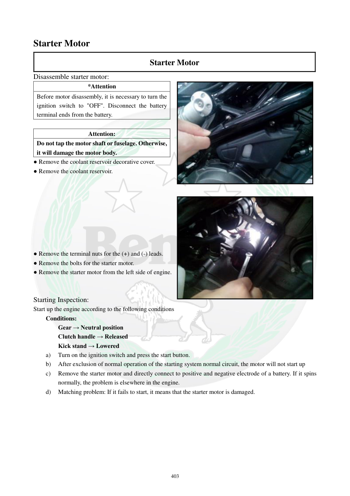

# Manual page 404

> Source: [page-0404.md](../source/page-0404.md)

## Page image / diagram

- [page-0404-img-01.jpeg](../images/embedded/page-0404-img-01.jpeg)

- [page-0404-img-02.jpeg](../images/embedded/page-0404-img-02.jpeg)

## Extracted text

# Source page 404

 
403 
Starter Motor 
Starter Motor 
Disassemble starter motor: 
*Attention 
Before motor disassembly, it is necessary to turn the 
ignition switch to "OFF". Disconnect the battery 
terminal ends from the battery.  
 
Attention: 
Do not tap the motor shaft or fuselage. Otherwise, 
it will damage the motor body. 
● Remove the coolant reservoir decorative cover.  
● Remove the coolant reservoir. 
 
 
 
 
 
 
 
 
● Remove the terminal nuts for the (+) and (-) leads. 
● Remove the bolts for the starter motor.  
● Remove the starter motor from the left side of engine. 
 
 
Starting Inspection:  
Start up the engine according to the following conditions 
Conditions: 
Gear → Neutral position 
Clutch handle → Released 
Kick stand → Lowered 
a) 
Turn on the ignition switch and press the start button. 
b) 
After exclusion of normal operation of the starting system normal circuit, the motor will not start up 
c) 
Remove the starter motor and directly connect to positive and negative electrode of a battery. If it spins 
normally, the problem is elsewhere in the engine.   
d) 
Matching problem: If it fails to start, it means that the starter motor is damaged.

## Persian notes

### باز کردن و تست اولیه موتور استارت
**هشدار:** قبل از باز کردن استارت، سوئیچ را روی OFF بگذارید و هر دو سر باتری را جدا کنید. به شفت یا بدنه استارت ضربه نزنید، چون می‌تواند به موتور استارت آسیب بزند.

ترتیب کلی طبق دفترچه:
1. قاب تزئینی مخزن انبساط را باز کنید.
2. مخزن انبساط را خارج کنید.
3. مهره‌های ترمینال مثبت و منفی استارت را باز کنید.
4. پیچ‌های اتصال استارت به موتور را باز کنید.
5. استارت را از سمت چپ موتور خارج کنید.

### تست مستقیم استارت
اگر مدار اصلی استارت سالم است ولی موتور روشن نمی‌شود، استارت را خارج کرده و مستقیماً به مثبت و منفی باتری وصل کنید:
- اگر استارت عادی می‌چرخد، ایراد احتمالاً خارج از خود موتور استارت و در مدار راه‌اندازی/برق‌رسانی است.
- اگر استارت نمی‌چرخد، خود موتور استارت نیاز به بررسی دارد.

**نکته:** برای TNT249 باید محل قطعات و مشخصات دقیق با نمونه موتور تطبیق داده شود، چون این دفترچه برای TNT300 است.
