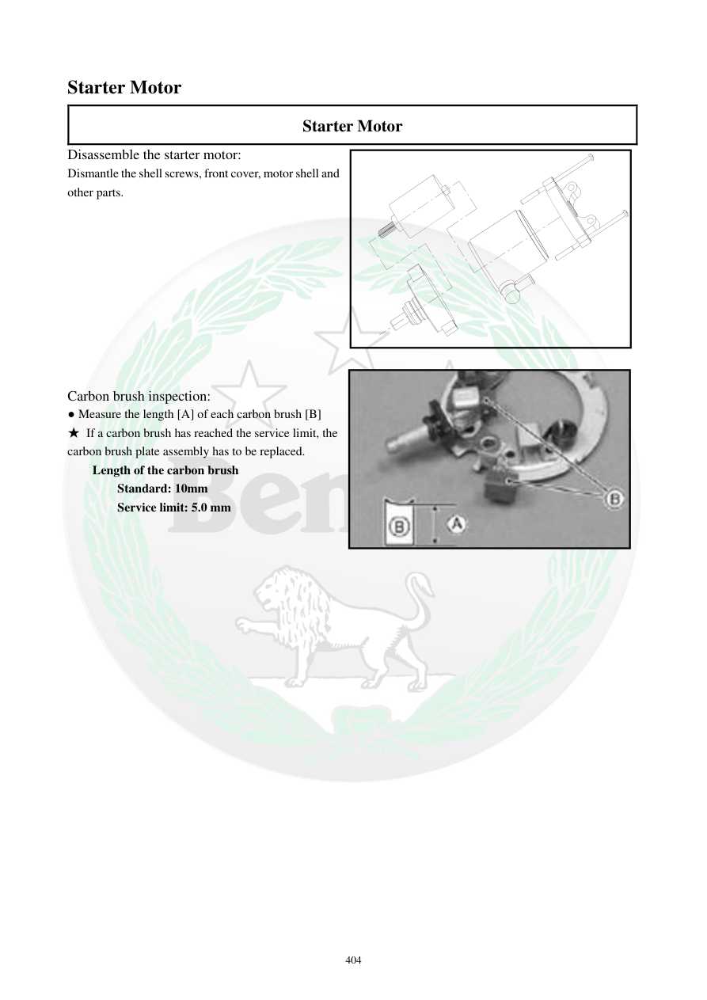

# Manual page 405

> Source: [page-0405.md](../source/page-0405.md)

## Page image / diagram

- [page-0405-img-01.jpeg](../images/embedded/page-0405-img-01.jpeg)

## Extracted text

# Source page 405

 
404 
Starter Motor 
Starter Motor 
Disassemble the starter motor: 
Dismantle the shell screws, front cover, motor shell and 
other parts.  
 
 
 
 
 
 
 
 
 
 
Carbon brush inspection: 
● Measure the length [A] of each carbon brush [B]  
★ If a carbon brush has reached the service limit, the 
carbon brush plate assembly has to be replaced.  
Length of the carbon brush 
Standard: 10mm 
Service limit: 5.0 mm

## Persian notes

### بررسی زغال‌های استارت
طول هر زغال را اندازه بگیرید.

- طول استاندارد: **10 mm**
- حد سرویس: **5.0 mm**
- اگر زغال به حد سرویس رسیده باشد، طبق دفترچه مجموعه نگهدارنده/صفحه زغال باید تعویض شود.

**برای مورد استارت فعلی:** اگر زغال‌ها کاملاً تمام شده باشند، قبل از خرید کل استارت باید خود هولدر و وضعیت آرمیچر/کموتاتور هم بررسی شود. ممکن است با تعویض مجموعه زغال قابل تعمیر باشد، اما وضعیت کموتاتور و سیم‌پیچ تعیین‌کننده است.
