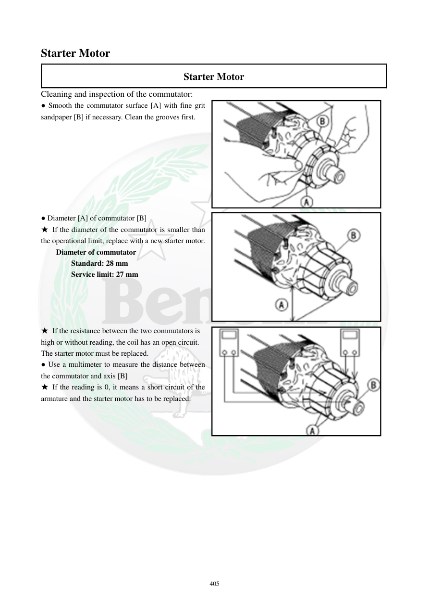

# Manual page 406

> Source: [page-0406.md](../source/page-0406.md)

## Page image / diagram

- [page-0406-img-01.png](../images/embedded/page-0406-img-01.png)

- [page-0406-img-02.png](../images/embedded/page-0406-img-02.png)

- [page-0406-img-03.png](../images/embedded/page-0406-img-03.png)

## Extracted text

# Source page 406

 
405 
Starter Motor 
Starter Motor 
Cleaning and inspection of the commutator: 
● Smooth the commutator surface [A] with fine grit 
sandpaper [B] if necessary. Clean the grooves first.  
 
 
 
 
 
 
 
  
● Diameter [A] of commutator [B] 
★ If the diameter of the commutator is smaller than 
the operational limit, replace with a new starter motor.  
Diameter of commutator  
Standard: 28 mm 
Service limit: 27 mm 
 
 
 
 
★ If the resistance between the two commutators is 
high or without reading, the coil has an open circuit. 
The starter motor must be replaced.  
● Use a multimeter to measure the distance between 
the commutator and axis [B] 
★ If the reading is 0, it means a short circuit of the 
armature and the starter motor has to be replaced.

## Persian notes

### بررسی کموتاتور و آرمیچر
- سطح کموتاتور را در صورت نیاز با سنباده نرم تمیز و صاف کنید و شیارها را ابتدا پاک کنید.
- قطر استاندارد کموتاتور: **28 mm**
- حد سرویس: **27 mm**
- اگر قطر از حد سرویس کمتر باشد، طبق دفترچه کل موتور استارت باید تعویض شود.
- مقاومت بین دو تیغه کموتاتور را با مولتی‌متر بررسی کنید. مقاومت خیلی زیاد یا عدم نمایش می‌تواند نشان‌دهنده قطع بودن سیم‌پیچ باشد.
- فاصله/اتصال بین کموتاتور و محور را طبق شکل دفترچه بررسی کنید. نمایش **0** در تست مورد اشاره دفترچه نشانه اتصال کوتاه آرمیچر است.

**نتیجه عملی:** صرفاً تمام شدن زغال به معنی خرابی آرمیچر نیست. زغال، کموتاتور و سیم‌پیچ باید جداگانه بررسی شوند.
