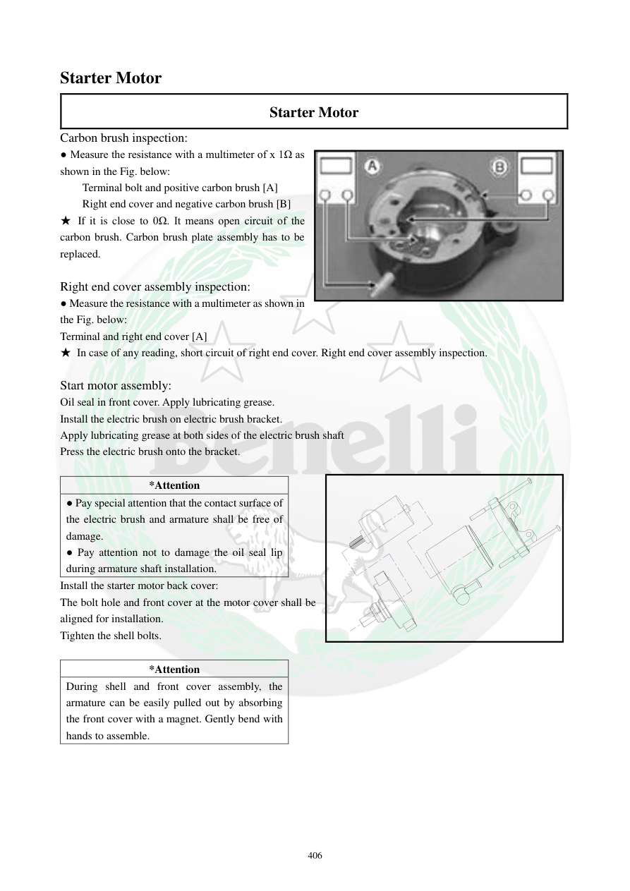

# Manual page 407

> Source: [page-0407.md](../source/page-0407.md)

## Page image / diagram

- [page-0407-img-01.jpeg](../images/embedded/page-0407-img-01.jpeg)

## Extracted text

# Source page 407

 
406 
Starter Motor 
Starter Motor 
Carbon brush inspection: 
● Measure the resistance with a multimeter of x 1Ω as 
shown in the Fig. below:  
Terminal bolt and positive carbon brush [A] 
Right end cover and negative carbon brush [B] 
★ If it is close to 0Ω. It means open circuit of the 
carbon brush. Carbon brush plate assembly has to be 
replaced.  
 
Right end cover assembly inspection: 
● Measure the resistance with a multimeter as shown in 
the Fig. below: 
Terminal and right end cover [A] 
★ In case of any reading, short circuit of right end cover. Right end cover assembly inspection. 
 
Start motor assembly: 
Oil seal in front cover. Apply lubricating grease.  
Install the electric brush on electric brush bracket. 
Apply lubricating grease at both sides of the electric brush shaft 
Press the electric brush onto the bracket. 
 
*Attention 
● Pay special attention that the contact surface of 
the electric brush and armature shall be free of 
damage.  
● Pay attention not to damage the oil seal lip 
during armature shaft installation.  
Install the starter motor back cover:  
The bolt hole and front cover at the motor cover shall be 
aligned for installation.   
Tighten the shell bolts. 
 
*Attention 
During shell and front cover assembly, the 
armature can be easily pulled out by absorbing 
the front cover with a magnet. Gently bend with 
hands to assemble.

## Persian notes

### تست هولدر زغال و درپوش انتهایی
با مولتی‌متر روی رنج **1Ω** طبق شکل دفترچه:
- بین پیچ ترمینال و زغال مثبت تست کنید.
- بین درپوش انتهایی و زغال منفی تست کنید.
- در صورت وجود اتصال نامناسب/مدار باز، مجموعه صفحه زغال باید بررسی و در صورت تأیید خرابی تعویض شود.
- بین ترمینال و درپوش انتهایی نباید اتصال الکتریکی وجود داشته باشد؛ وجود خوانش در این تست طبق دفترچه نشانه اتصال کوتاه درپوش است.

### مونتاژ
- محل کاسه‌نمد درپوش جلو گریس‌کاری شود.
- شفت زغال با مقدار مناسب گریس روان‌کاری شود.
- سطح تماس زغال و آرمیچر نباید آسیب دیده باشد.
- هنگام جا زدن آرمیچر، لبه کاسه‌نمد آسیب نبیند.
- سوراخ‌های پیچ درپوش و پوسته را هم‌راستا کنید و سپس پیچ‌های پوسته را ببندید.

**نکته مهم:** گریس باید در محل‌های مشخص‌شده استفاده شود و نباید روی سطح تماس زغال با کموتاتور ریخته شود.

### نتیجه مهم درباره روغن داخل پوسته استارت
دفترچه در همین صفحه صراحتاً **oil seal در قسمت جلوی درپوش استارت** را نشان می‌دهد و هنگام مونتاژ تأکید می‌کند که لب کاسه‌نمد هنگام جا زدن شفت آرمیچر آسیب نبیند. بنابراین این کاسه‌نمد یک مانع آب‌بندی مستقل از O-Ring بیرونی 24×3.1 محل نصب استارت است.

در کاتالوگ قطعات TNT249S، برای مجموعه E11 فقط **موتور کامل استارت 249016030000** و **O-Ring 240013060000** به‌صورت قطعات اصلی فهرست شده‌اند و کاسه‌نمد داخلی استارت به‌عنوان قطعه جداگانه در این فهرست نیامده است. citeturn0search24 بنابراین اگر روغن داخل پوسته استارت و نزدیک آرمیچر دیده شده، نباید با تعویض صرفِ O-Ring بیرونی فرض کرد مشکل حل شده است.

**برای استارت بازشده فعلی:** ابتدا محل چرب/روغنی روی شفت و اطراف کاسه‌نمد جلوی استارت تمیز شود، سپس خود لب کاسه‌نمد از نظر پارگی، خشک‌شدن، له‌شدگی و خروج از جای خود بررسی شود. در زمان مونتاژ، گریس فقط طبق دستور دفترچه روی محل کاسه‌نمد و نقاط مجاز زده شود و سطح زغال/کموتاتور آلوده به گریس نشود.
