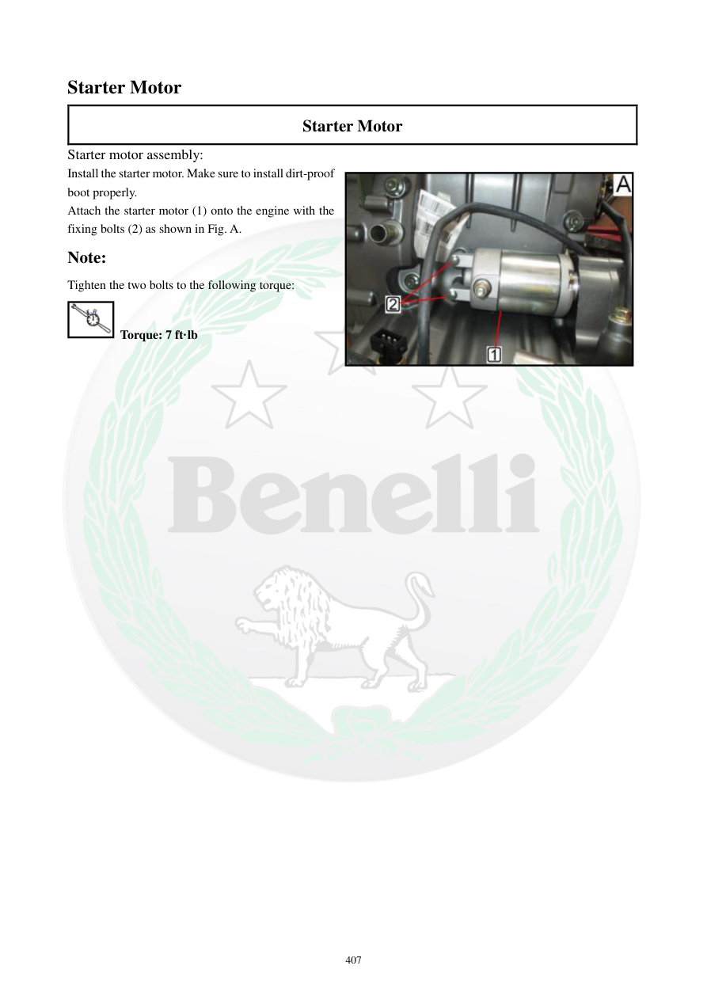

# Manual page 408

> Source: [page-0408.md](../source/page-0408.md)

## Page image / diagram

- [page-0408-img-02.jpeg](../images/embedded/page-0408-img-02.jpeg)

## Extracted text

# Source page 408

 
407 
Starter Motor 
Starter Motor 
Starter motor assembly: 
Install the starter motor. Make sure to install dirt-proof 
boot properly.  
Attach the starter motor (1) onto the engine with the 
fixing bolts (2) as shown in Fig. A.  
Note: 
Tighten the two bolts to the following torque: 
 Torque: 7 ft·lb

## Persian notes

<!-- Persian translation/explanation will be added here. -->
