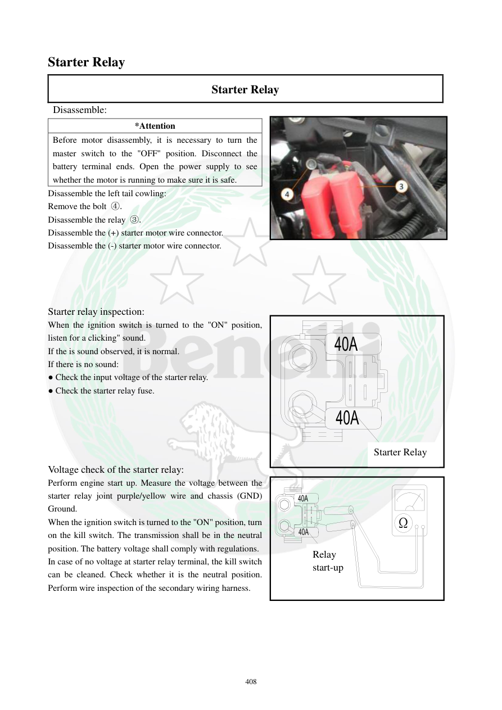

# Manual page 409

> Source: [page-0409.md](../source/page-0409.md)

## Page image / diagram

- [page-0409-img-01.jpeg](../images/embedded/page-0409-img-01.jpeg)

## Extracted text

# Source page 409

 
408 
Starter Relay  
Starter Relay  
 Disassemble: 
Disassemble the left tail cowling: 
Remove the bolt ④. 
Disassemble the relay ③. 
Disassemble the (+) starter motor wire connector. 
Disassemble the (-) starter motor wire connector. 
 
 
 
 
Starter relay inspection: 
When the ignition switch is turned to the "ON" position, 
listen for a clicking" sound.  
If the is sound observed, it is normal.  
If there is no sound: 
● Check the input voltage of the starter relay.  
● Check the starter relay fuse. 
 
 
 
 
 
Voltage check of the starter relay: 
Perform engine start up. Measure the voltage between the 
starter relay joint purple/yellow wire and chassis (GND) 
Ground.  
When the ignition switch is turned to the "ON" position, turn 
on the kill switch. The transmission shall be in the neutral 
position. The battery voltage shall comply with regulations.  
In case of no voltage at starter relay terminal, the kill switch 
can be cleaned. Check whether it is the neutral position. 
Perform wire inspection of the secondary wiring harness.   
 
 
*Attention 
Before motor disassembly, it is necessary to turn the 
master switch to the "OFF" position. Disconnect the 
battery terminal ends. Open the power supply to see 
whether the motor is running to make sure it is safe.  
Ω
Starter Relay  
Relay 
start-up

## Persian notes

<!-- Persian translation/explanation will be added here. -->
