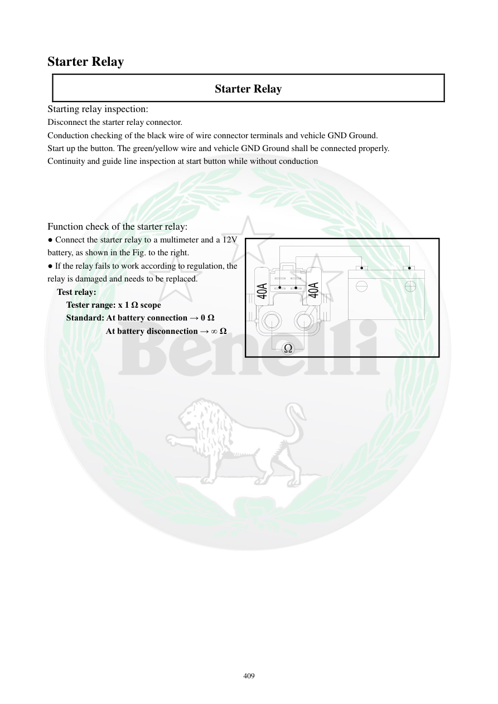

# Manual page 410

> Source: [page-0410.md](../source/page-0410.md)

## Page image / diagram

## Extracted text

# Source page 410

 
409 
Starter Relay  
Starter Relay 
Starting relay inspection: 
Disconnect the starter relay connector. 
Conduction checking of the black wire of wire connector terminals and vehicle GND Ground.  
Start up the button. The green/yellow wire and vehicle GND Ground shall be connected properly.  
Continuity and guide line inspection at start button while without conduction 
 
 
 
 
Function check of the starter relay: 
● Connect the starter relay to a multimeter and a 12V 
battery, as shown in the Fig. to the right. 
● If the relay fails to work according to regulation, the 
relay is damaged and needs to be replaced.  
Test relay: 
Tester range: x 1 Ω scope 
Standard: At battery connection → 0 Ω 
  At battery disconnection → ∞ Ω 
 
 
 
 
 
Ω

## Persian notes

### تست عملکرد رله استارت
- کانکتور رله را جدا کنید.
- پیوستگی سیم مشکی نسبت به بدنه و مسیر سیم سبز/زرد هنگام فشردن دکمه استارت بررسی شود.
- برای تست خود رله، رله را طبق شکل به مولتی‌متر و باتری **12 V** متصل کنید.
- رنج مولتی‌متر: **×1 Ω**.
- طبق دفترچه، در حالت اتصال باتری مقدار باید حدود **0 Ω** و در حالت قطع باتری **∞ Ω** باشد.
- اگر عملکرد مطابق این وضعیت نباشد، رله معیوب و نیازمند تعویض است.
