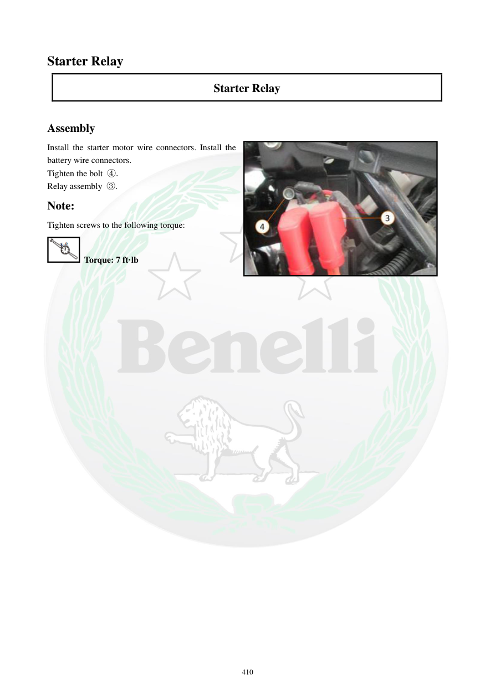

# Manual page 411

> Source: [page-0411.md](../source/page-0411.md)

## Page image / diagram

- [page-0411-img-02.jpeg](../images/embedded/page-0411-img-02.jpeg)

## Extracted text

# Source page 411

 
410 
Starter Relay  
Starter Relay 
 
Assembly 
Install the starter motor wire connectors. Install the 
battery wire connectors.  
Tighten the bolt ④. 
Relay assembly ③. 
Note: 
Tighten screws to the following torque: 
 Torque: 7 ft·lb

## Persian notes

### نصب رله استارت
- کانکتورهای سیم موتور استارت و سیم باتری را نصب کنید.
- پیچ نگهدارنده را ببندید.
- مجموعه رله را در محل خود نصب کنید.
- گشتاور پیچ مشخص‌شده: **7 ft·lb ≈ 9.5 N·m**.
- قبل از روشن‌کردن موتور، محکم بودن اتصالات مثبت و منفی و قفل‌شدن کانکتورها بررسی شود.
