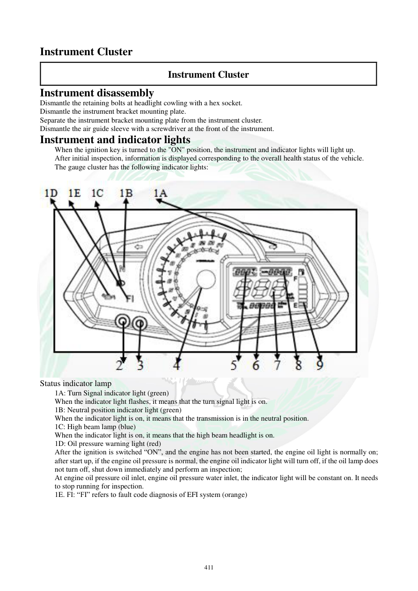

# Manual page 412

> Source: [page-0412.md](../source/page-0412.md)

## Page image / diagram

- [page-0412-img-01.jpeg](../images/embedded/page-0412-img-01.jpeg)

## Extracted text

# Source page 412

 
411 
Instrument Cluster 
Instrument Cluster 
Instrument disassembly 
Dismantle the retaining bolts at headlight cowling with a hex socket.  
Dismantle the instrument bracket mounting plate. 
Separate the instrument bracket mounting plate from the instrument cluster. 
Dismantle the air guide sleeve with a screwdriver at the front of the instrument.  
Instrument and indicator lights 
When the ignition key is turned to the "ON" position, the instrument and indicator lights will light up.  
After initial inspection, information is displayed corresponding to the overall health status of the vehicle.  
The gauge cluster has the following indicator lights: 
 
 
Status indicator lamp 
1A: Turn Signal indicator light (green) 
When the indicator light flashes, it means that the turn signal light is on. 
1B: Neutral position indicator light (green) 
When the indicator light is on, it means that the transmission is in the neutral position.  
1C: High beam lamp (blue) 
When the indicator light is on, it means that the high beam headlight is on. 
1D: Oil pressure warning light (red) 
After the ignition is switched “ON”, and the engine has not been started, the engine oil light is normally on; 
after start up, if the engine oil pressure is normal, the engine oil indicator light will turn off, if the oil lamp does 
not turn off, shut down immediately and perform an inspection; 
At engine oil pressure oil inlet, engine oil pressure water inlet, the indicator light will be constant on. It needs 
to stop running for inspection.  
1E. FI: “FI” refers to fault code diagnosis of EFI system (orange)

## Persian notes

### باز کردن و علائم صفحه کیلومتر
- برای بازکردن، پیچ‌های نگهدارنده روی قاب چراغ جلو را با بکس آلن باز کنید، صفحه نگهدارنده آمپر را جدا کنید و سپس قاب/صفحه را از پشت آزاد کنید.
- بوش/مجرای هدایت هوا جلوی صفحه نیز طبق شکل با ابزار مناسب جدا می‌شود.

**چراغ‌های نشانگر:**
- **Turn Signal سبز:** فعال بودن راهنما.
- **Neutral سبز:** قرار داشتن گیربکس در خلاص.
- **High Beam آبی:** روشن بودن نور بالا.
- **Oil Pressure قرمز:** با سوئیچ ON و موتور خاموش روشن بودنش طبیعی است؛ بعد از روشن‌شدن موتور باید خاموش شود. اگر خاموش نشد، موتور را فوراً خاموش و سیستم روغن‌کاری را بررسی کنید.
- **FI نارنجی:** مربوط به خطای سیستم انژکتوری EFI است.
