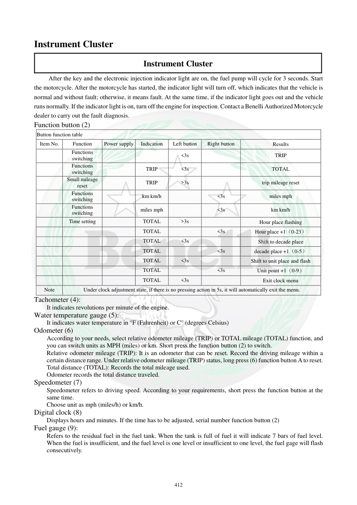

# Manual page 413

> Source: [page-0413.md](../source/page-0413.md)

## Page image / diagram

## Extracted text

# Source page 413

 
412 
Instrument Cluster 
Instrument Cluster 
  After the key and the electronic injection indicator light are on, the fuel pump will cycle for 3 seconds. Start 
the motorcycle. After the motorcycle has started, the indicator light will turn off, which indicates that the vehicle is 
normal and without fault; otherwise, it means fault. At the same time, if the indicator light goes out and the vehicle 
runs normally. If the indicator light is on, turn off the engine for inspection. Contact a Benelli Authorized Motorcycle 
dealer to carry out the fault diagnosis.  
Function button (2) 
Button function table 
Item No. 
Function 
Power supply 
Indication 
Left button 
Right button 
Results 
 
Functions 
switching 
 
 
<3s 
 
TRIP 
 
Functions 
switching 
 
TRIP 
<3s 
 
TOTAL 
 
Small mileage 
reset 
 
TRIP 
>3s 
 
trip mileage reset 
 
Functions 
switching 
 
km km/h 
 
<3s 
miles mph 
 
Functions 
switching 
 
miles mph 
 
<3s 
km km/h 
 
Time setting 
 
TOTAL 
>3s 
 
Hour place flashing 
 
 
 
TOTAL 
 
<3s 
Hour place +1（0-23） 
 
 
 
TOTAL 
<3s 
 
Shift to decade place 
 
 
 
TOTAL 
 
<3s 
decade place +1（0-5） 
 
 
 
TOTAL 
<3s 
 
Shift to unit place and flash 
 
 
 
TOTAL 
 
<3s 
Unit point +1（0-9） 
 
 
 
TOTAL 
<3s 
 
Exit clock menu 
Note 
Under clock adjustment state, if there is no pressing action in 5s, it will automatically exit the menu. 
Tachometer (4): 
It indicates revolutions per minute of the engine.  
Water temperature gauge (5): 
It indicates water temperature in °F (Fahrenheit) or C° (degrees Celsius) 
Odometer (6) 
According to your needs, select relative odometer mileage (TRIP) or TOTAL mileage (TOTAL) function, and 
you can switch units as MPH (miles) or km. Short press the function button (2) to switch.  
Relative odometer mileage (TRIP): It is an odometer that can be reset. Record the driving mileage within a 
certain distance range. Under relative odometer mileage (TRIP) status, long press (6) function button A to reset.  
Total distance (TOTAL): Records the total mileage used.  
Odometer records the total distance traveled.  
Speedometer (7) 
Speedometer refers to driving speed. According to your requirements, short press the function button at the 
same time.   
Choose unit as mph (miles/h) or km/h.  
Digital clock (8) 
Displays hours and minutes. If the time has to be adjusted, serial number function button (2)  
Fuel gauge (9): 
Refers to the residual fuel in the fuel tank. When the tank is full of fuel it will indicate 7 bars of fuel level. 
When the fuel is insufficient, and the fuel level is one level or insufficient to one level, the fuel gage will flash 
consecutively.

## Persian notes

### عملکرد صفحه کیلومتر و دکمه تنظیمات
- پس از ON کردن سوئیچ، چراغ FI روشن می‌شود و پمپ بنزین حدود **3 ثانیه** کار می‌کند. پس از روشن‌شدن موتور، خاموش‌شدن FI نشانه نبود خطای ثبت‌شده طبق منطق دفترچه است؛ روشن ماندن آن نیازمند بررسی خطا و عیب‌یابی است.
- **TRIP:** مسافت قابل ریست. با نگه‌داشتن دکمه مربوطه بیش از 3 ثانیه قابل صفرکردن است.
- **TOTAL:** مسافت کل طی‌شده.
- با فشار کوتاه دکمه، بین TRIP و TOTAL و همچنین واحدهای **km/km·h** و **mile/mph** جابه‌جا می‌شوید.
- تنظیم ساعت با ورود به منوی TOTAL و نگه‌داشتن دکمه بیش از 3 ثانیه انجام می‌شود؛ اعداد ساعت، دهگان دقیقه و یکان دقیقه مرحله‌به‌مرحله تنظیم می‌شوند.
- اگر در حالت تنظیم ساعت **5 ثانیه** هیچ دکمه‌ای فشرده نشود، منو خودکار خارج می‌شود.
- دورسنج RPM، دمای آب، سرعت‌سنج و نشانگر سوخت نیز روی صفحه نمایش داده می‌شوند.
- باک پر طبق دفترچه **7 خط** نشان می‌دهد؛ در سطح پایین، نشانگر سوخت به‌صورت پیوسته چشمک می‌زند.
