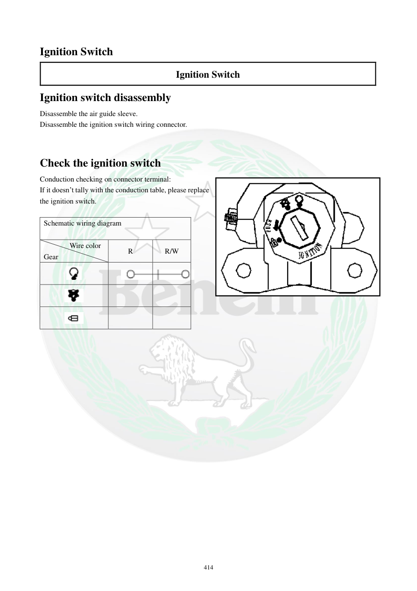

# Manual page 415

> Source: [page-0415.md](../source/page-0415.md)

## Page image / diagram

- [page-0415-img-01.png](../images/embedded/page-0415-img-01.png)

- [page-0415-img-02.png](../images/embedded/page-0415-img-02.png)

- [page-0415-img-03.png](../images/embedded/page-0415-img-03.png)

- [page-0415-img-04.png](../images/embedded/page-0415-img-04.png)

- [page-0415-img-05.png](../images/embedded/page-0415-img-05.png)

## Extracted text

# Source page 415

 
414 
Ignition Switch 
Ignition Switch 
Ignition switch disassembly 
Disassemble the air guide sleeve.  
Disassemble the ignition switch wiring connector. 
 
 
Check the ignition switch 
Conduction checking on connector terminal: 
If it doesn’t tally with the conduction table, please replace 
the ignition switch.  
 
Schematic wiring diagram  
 
Wire color  
Gear 
R 
R/W

## Persian notes

<!-- Persian translation/explanation will be added here. -->
