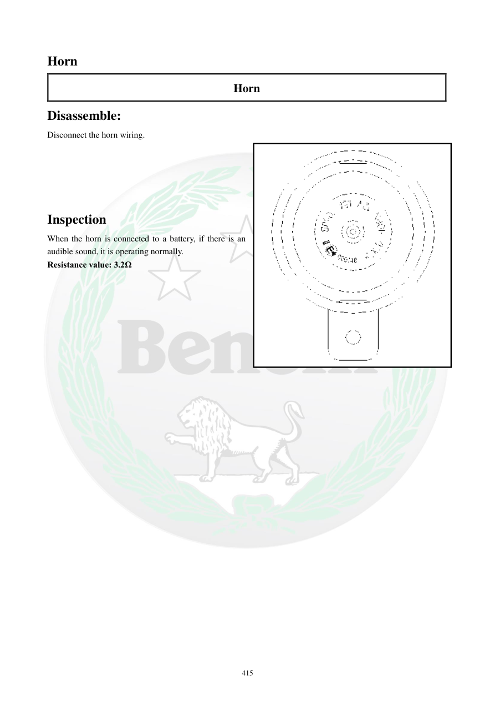

# Manual page 416

> Source: [page-0416.md](../source/page-0416.md)

## Page image / diagram

- [page-0416-img-01.png](../images/embedded/page-0416-img-01.png)

## Extracted text

# Source page 416

 
415 
Horn 
Horn 
Disassemble: 
Disconnect the horn wiring. 
 
 
 
 
 
Inspection 
When the horn is connected to a battery, if there is an 
audible sound, it is operating normally.  
Resistance value: 3.2Ω

## Persian notes

### بوق
- کانکتور سیم‌کشی بوق را جدا کنید.
- برای تست مستقیم، بوق را به باتری متصل کنید؛ اگر صدای بوق ایجاد شد، عملکرد آن طبیعی است.
- مقاومت اعلام‌شده: **3.2 Ω**.
- اگر بوق صدا ندارد، علاوه بر خود بوق، تغذیه، بدنه و مسیر سیم‌کشی نیز باید بررسی شوند.
