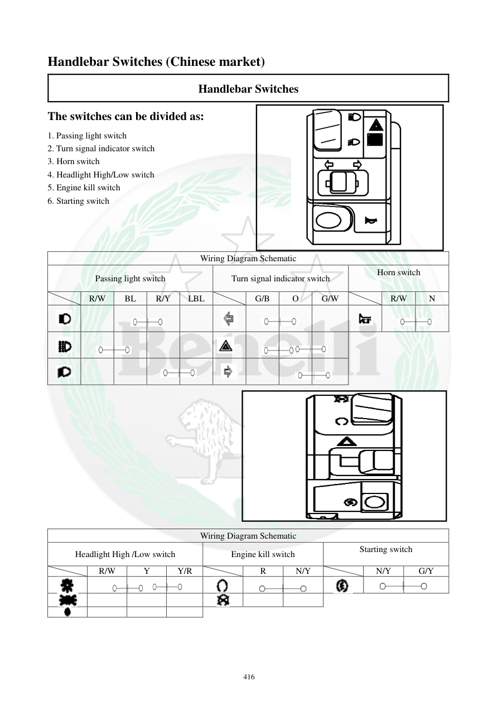

# Manual page 417

> Source: [page-0417.md](../source/page-0417.md)

## Page image / diagram

- [page-0417-img-02.png](../images/embedded/page-0417-img-02.png)

- [page-0417-img-03.png](../images/embedded/page-0417-img-03.png)

- [page-0417-img-04.png](../images/embedded/page-0417-img-04.png)

- [page-0417-img-05.png](../images/embedded/page-0417-img-05.png)

- [page-0417-img-06.png](../images/embedded/page-0417-img-06.png)

- [page-0417-img-07.png](../images/embedded/page-0417-img-07.png)

- [page-0417-img-08.png](../images/embedded/page-0417-img-08.png)

- [page-0417-img-09.png](../images/embedded/page-0417-img-09.png)

- [page-0417-img-10.png](../images/embedded/page-0417-img-10.png)

- [page-0417-img-11.png](../images/embedded/page-0417-img-11.png)

- [page-0417-img-12.png](../images/embedded/page-0417-img-12.png)

- [page-0417-img-13.png](../images/embedded/page-0417-img-13.png)

- [page-0417-img-14.png](../images/embedded/page-0417-img-14.png)

- [page-0417-img-15.png](../images/embedded/page-0417-img-15.png)

- [page-0417-img-16.png](../images/embedded/page-0417-img-16.png)

- [page-0417-img-17.png](../images/embedded/page-0417-img-17.png)

- [page-0417-img-18.png](../images/embedded/page-0417-img-18.png)

## Extracted text

# Source page 417

 
416 
Handlebar Switches (Chinese market) 
Handlebar Switches 
The switches can be divided as: 
1. Passing light switch 
2. Turn signal indicator switch 
3. Horn switch 
4. Headlight High/Low switch 
5. Engine kill switch 
6. Starting switch 
 
 
 
Wiring Diagram Schematic 
Passing light switch 
Turn signal indicator switch 
Horn switch 
 
 
R/W 
BL 
R/Y 
LBL 
 
G/B 
O 
G/W 
 
R/W 
N 
 
 
 
 
 
 
 
 
 
 
 
 
 
 
 
 
 
 
 
 
 
 
 
 
 
 
 
 
 
 
 
 
 
 
 
 
 
 
 
 
 
 
 
 
 
 
 
Wiring Diagram Schematic 
Headlight High /Low switch 
Engine kill switch 
Starting switch 
 
 
R/W 
Y 
Y/R 
 
R 
N/Y 
 
N/Y 
G/Y

## Persian notes

### کلیدهای روی فرمان
طبق صفحه، مجموعه کلیدهای فرمان شامل:
1. **Passing Light**، فلاشر/نور عبوری
2. **Turn Signal**، راهنما
3. **Horn**، بوق
4. **Headlight High/Low**، نور بالا/پایین
5. **Engine Kill Switch**، کلید قطع موتور
6. **Starting Switch**، دکمه استارت

- صفحه دو دیاگرام سیم‌کشی برای مجموعه کلیدها ارائه می‌کند.
- رنگ‌های سیم شامل R/W، BL، R/Y، LBL، G/B، O، G/W، Y، Y/R، R، N/Y و G/Y هستند.
- چون این صفحه صراحتاً **Chinese market** را ذکر می‌کند، رنگ سیم و آرایش مدار نباید بدون تطبیق با نسخه بازار TNT249 مورد استفاده قرار گیرد.
- برای شناسایی دقیق پایه‌های هر کلید، **تصویر دیاگرام همین صفحه مرجع اصلی است**.
