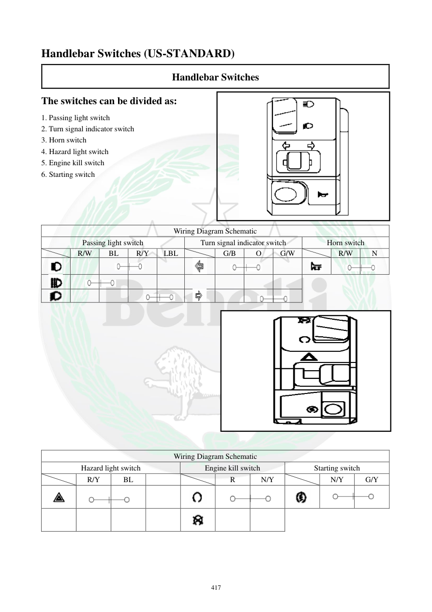

# Manual page 418

> Source: [page-0418.md](../source/page-0418.md)

## Page image / diagram

- [page-0418-img-11.png](../images/embedded/page-0418-img-11.png)

- [page-0418-img-12.png](../images/embedded/page-0418-img-12.png)

- [page-0418-img-13.png](../images/embedded/page-0418-img-13.png)

- [page-0418-img-14.png](../images/embedded/page-0418-img-14.png)

- [page-0418-img-15.png](../images/embedded/page-0418-img-15.png)

## Extracted text

# Source page 418

 
417 
Handlebar Switches (US-STANDARD) 
Handlebar Switches 
The switches can be divided as: 
1. Passing light switch 
2. Turn signal indicator switch 
3. Horn switch 
4. Hazard light switch 
5. Engine kill switch 
6. Starting switch 
 
 
 
 
Wiring Diagram Schematic 
Passing light switch 
Turn signal indicator switch 
Horn switch 
 
R/W 
BL 
R/Y 
LBL 
 
G/B 
O 
G/W 
 
R/W 
N 
 
 
 
 
 
 
 
 
 
 
 
 
 
 
 
 
 
 
 
 
 
 
 
 
 
 
 
 
 
 
 
 
 
 
 
 
 
 
 
 
 
 
 
 
 
 
 
Wiring Diagram Schematic 
Hazard light switch 
Engine kill switch 
Starting switch 
 
R/Y 
BL 
 
 
R 
N/Y 
 
N/Y 
G/Y

## Persian notes

### کلیدهای روی فرمان، نسخه US-STANDARD
این صفحه مربوط به **نسخه استاندارد بازار آمریکا** است و آرایش کلیدها با صفحه ۴۱۷ متفاوت است:
1. Passing Light، نور عبوری
2. Turn Signal، راهنما
3. Horn، بوق
4. Hazard Light، فلاشر اضطراری
5. Engine Kill، قطع موتور
6. Starting، استارت

- دیاگرام صفحه مسیر سیم‌کشی هر مجموعه را نشان می‌دهد.
- رنگ‌های سیم شامل R/W، BL، R/Y، LBL، G/B، O، G/W، R، N/Y و G/Y است.
- چون نسخه بازار مشخص شده، برای تعمیر TNT249 باید **دیاگرام همان نسخه موتور** با این صفحه تطبیق داده شود.
