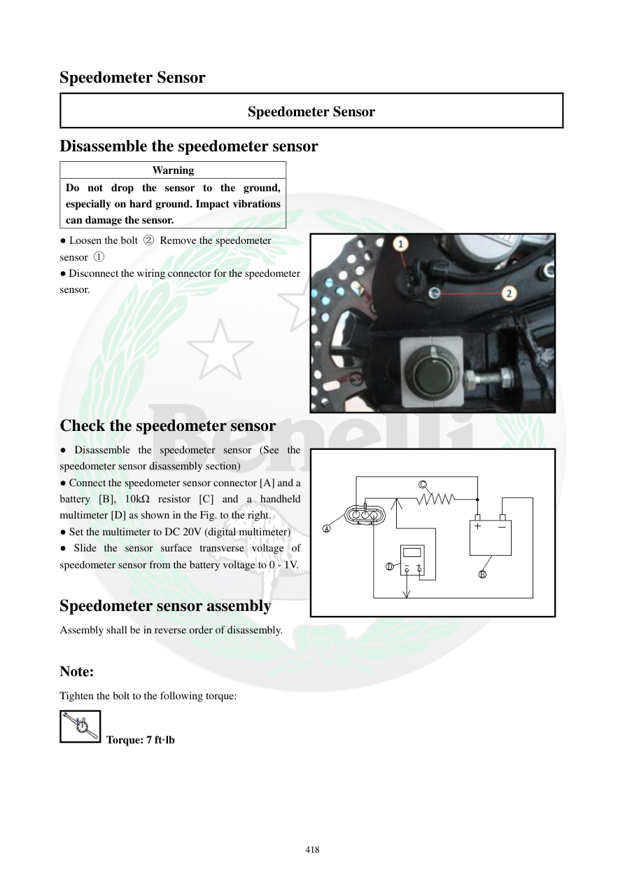

# Manual page 419

> Source: [page-0419.md](../source/page-0419.md)

## Page image / diagram

- [page-0419-img-02.png](../images/embedded/page-0419-img-02.png)

- [page-0419-img-03.jpeg](../images/embedded/page-0419-img-03.jpeg)

## Extracted text

# Source page 419

 
418 
Speedometer Sensor 
Speedometer Sensor 
Disassemble the speedometer sensor 
Warning 
Do not drop the sensor to the ground, 
especially on hard ground. Impact vibrations 
can damage the sensor.  
● Loosen the bolt ② Remove the speedometer 
sensor ① 
● Disconnect the wiring connector for the speedometer 
sensor. 
 
 
 
 
 
 
Check the speedometer sensor 
● Disassemble the speedometer sensor (See the 
speedometer sensor disassembly section) 
● Connect the speedometer sensor connector [A] and a 
battery [B], 10kΩ resistor [C] and a handheld 
multimeter [D] as shown in the Fig. to the right.  
● Set the multimeter to DC 20V (digital multimeter) 
● Slide the sensor surface transverse voltage of 
speedometer sensor from the battery voltage to 0 - 1V.  
 
Speedometer sensor assembly 
Assembly shall be in reverse order of disassembly.  
 
Note: 
Tighten the bolt to the following torque: 
 Torque: 7 ft·lb

## Persian notes

<!-- Persian translation/explanation will be added here. -->
