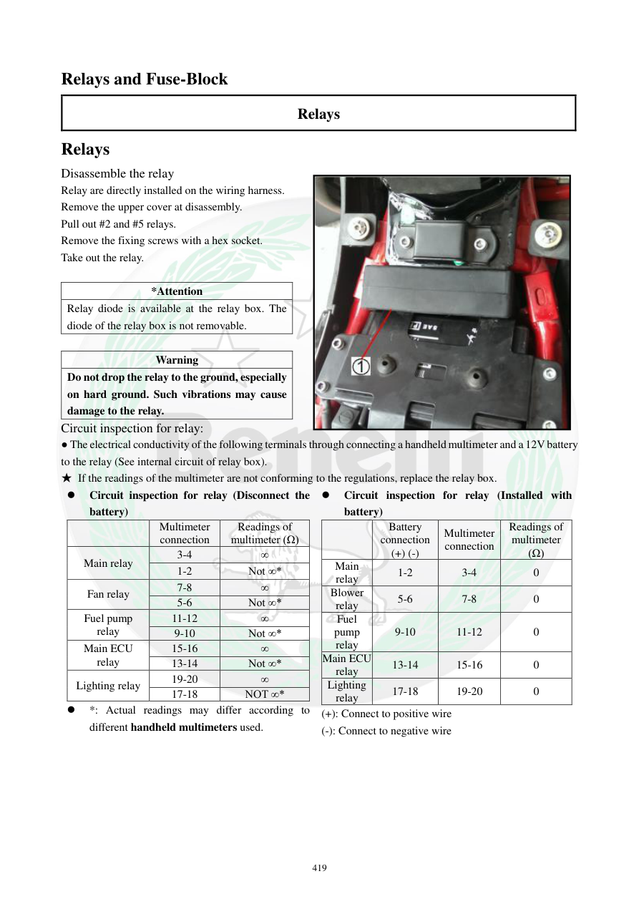

# Manual page 420

> Source: [page-0420.md](../source/page-0420.md)

## Page image / diagram

- [page-0420-img-01.jpeg](../images/embedded/page-0420-img-01.jpeg)

## Extracted text

# Source page 420

 
419 
Relays and Fuse-Block 
Relays 
Relays 
Disassemble the relay  
Relay are directly installed on the wiring harness.  
Remove the upper cover at disassembly.  
Pull out #2 and #5 relays.  
Remove the fixing screws with a hex socket.  
Take out the relay. 
 
*Attention 
Relay diode is available at the relay box. The 
diode of the relay box is not removable.   
 
Warning 
Do not drop the relay to the ground, especially 
on hard ground. Such vibrations may cause 
damage to the relay.  
Circuit inspection for relay: 
● The electrical conductivity of the following terminals through connecting a handheld multimeter and a 12V battery       
to the relay (See internal circuit of relay box).    
★ If the readings of the multimeter are not conforming to the regulations, replace the relay box.  
 
Circuit inspection for relay (Disconnect the 
battery) 
 
Multimeter 
connection 
Readings of 
multimeter (Ω) 
Main relay 
3-4 
∞ 
1-2 
Not ∞* 
Fan relay 
7-8 
∞ 
5-6 
Not ∞* 
Fuel pump 
relay 
11-12 
∞ 
9-10 
Not ∞* 
Main ECU 
relay 
15-16 
∞ 
13-14 
Not ∞* 
Lighting relay 
19-20 
∞ 
17-18 
NOT ∞* 
 
*: Actual readings may differ according to 
different handheld multimeters used.  
 
Circuit inspection for relay (Installed with 
battery) 
 
Battery 
connection 
(+) (-) 
Multimeter 
connection 
Readings of 
multimeter 
(Ω) 
Main 
relay 
1-2 
3-4 
0 
Blower 
relay 
5-6 
7-8 
0 
Fuel 
pump 
relay 
9-10 
11-12 
0 
Main ECU 
relay 
13-14 
15-16 
0 
Lighting 
relay 
17-18 
19-20 
0 
(+): Connect to positive wire 
(-): Connect to negative wire

## Persian notes

### رله‌ها و جعبه فیوز
- رله‌ها مستقیماً روی دسته‌سیم نصب شده‌اند و برای دسترسی، درپوش بالایی باز می‌شود.
- رله‌های شماره **2 و 5** طبق صفحه بیرون کشیده می‌شوند.
- دیود داخل جعبه رله **قابل جداکردن نیست**.
- رله را نیندازید؛ ضربه می‌تواند باعث خرابی آن شود.

**تست مدار با باتری قطع:**
- Main relay: پایه‌های 3-4 باید **∞** و 1-2 نباید ∞ باشند.
- Fan/Blower relay: 7-8 باید ∞ و 5-6 نباید ∞ باشند.
- Fuel pump relay: 11-12 باید ∞ و 9-10 نباید ∞ باشند.
- Main ECU relay: 15-16 باید ∞ و 13-14 نباید ∞ باشند.
- Lighting relay: 19-20 باید ∞ و 17-18 نباید ∞ باشند.

**تست با باتری متصل:** طبق جدول، جفت کنتاکت خروجی هر رله باید حدود **0 Ω** نشان دهد. به‌دلیل وابستگی نتیجه به نوع مولتی‌متر، برای جهت دقیق پراب‌ها و پایه‌ها تصویر صفحه مرجع اصلی است.
