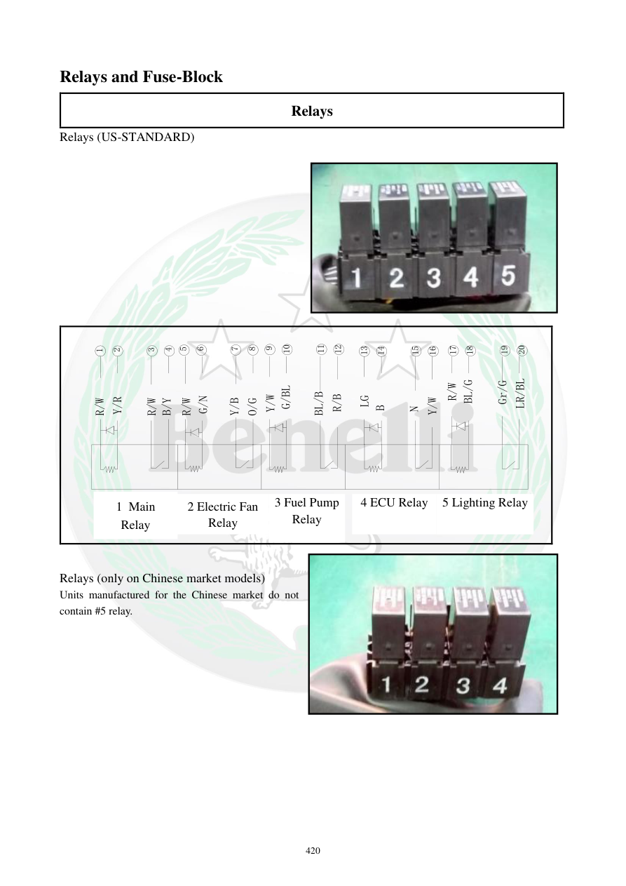

# Manual page 421

> Source: [page-0421.md](../source/page-0421.md)

## Page image / diagram

- [page-0421-img-01.jpeg](../images/embedded/page-0421-img-01.jpeg)

- [page-0421-img-02.jpeg](../images/embedded/page-0421-img-02.jpeg)

## Extracted text

# Source page 421

 
420 
Relays and Fuse-Block 
Relays 
Relays (US-STANDARD) 
 
 
 
 
 
 
 
 
 
20
19
18
17
16
15
14
13
12
11
10
9
8
7
6
5
4
3
2
1
LR/BL
N
LG
B
Y/W
1主继电器
Y/W
G/BL
R/W
5灯光继电器
Y/B
G/N
O/G
Y/R
R/W
R/W
B/Y
2风扇继电器  3油泵
  继电器
BL/B
R/B
R/W
BL/G
Gr/G
4ECU继电器
  
 
Relays (only on Chinese market models) 
Units manufactured for the Chinese market do not 
contain #5 relay.  
 
 
 
1 Main 
Relay 
2 Electric Fan 
Relay 
3 Fuel Pump 
Relay 
4 ECU Relay 5 Lighting Relay

## Persian notes

### آرایش رله‌ها، نسخه‌های بازار
صفحه دو آرایش را نشان می‌دهد:
- **US-STANDARD:** رله‌های Main، Electric Fan، Fuel Pump، ECU و Lighting.
- **Chinese market:** پنج رله کامل وجود ندارد و طبق متن، مدل‌های بازار چین **رله شماره 5** را ندارند.
- شماره‌گذاری و رنگ سیم‌ها در دیاگرام برای تشخیص محل رله‌ها مهم است.
- چون بازار در صفحه صراحتاً مشخص شده، برای تعمیر یک TNT249 واقعی باید آرایش سیم‌کشی و جعبه رله همان نسخه بازار بررسی شود.
