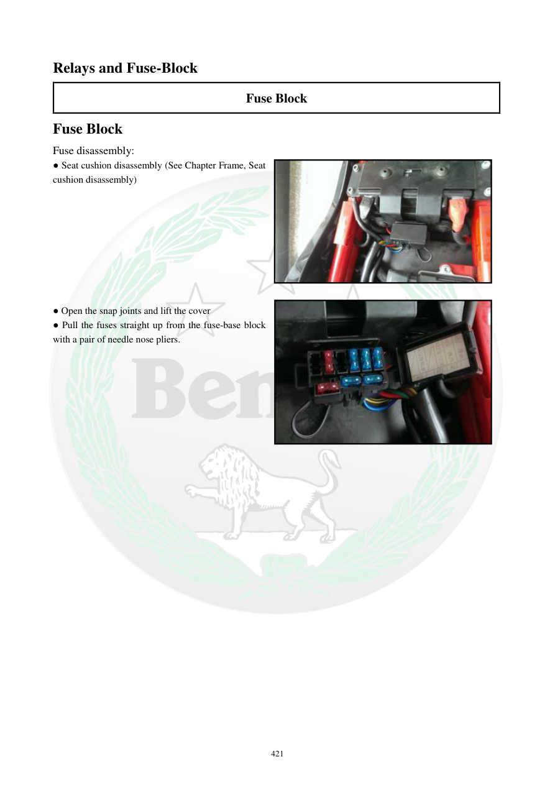

# Manual page 422

> Source: [page-0422.md](../source/page-0422.md)

## Page image / diagram

- [page-0422-img-01.jpeg](../images/embedded/page-0422-img-01.jpeg)

- [page-0422-img-02.jpeg](../images/embedded/page-0422-img-02.jpeg)

## Extracted text

# Source page 422

 
421 
Relays and Fuse-Block 
Fuse Block 
Fuse Block 
Fuse disassembly: 
● Seat cushion disassembly (See Chapter Frame, Seat 
cushion disassembly)  
 
 
 
 
 
 
 
 
● Open the snap joints and lift the cover 
● Pull the fuses straight up from the fuse-base block 
with a pair of needle nose pliers.

## Persian notes

### باز کردن جعبه فیوز
- ابتدا زین را طبق دستورالعمل بخش شاسی باز کنید.
- خارهای درپوش را آزاد کرده و درپوش جعبه فیوز را بالا بیاورید.
- فیوزها را با **انبر دم‌باریک** مستقیم به سمت بالا از پایه بیرون بکشید.
- هنگام خارج‌کردن فیوز، کشیدن مستقیم بهتر از پیچاندن یا فشار جانبی است تا پایه فیوز آسیب نبیند.
- برای انتخاب آمپراژ جایگزین، مقدار درج‌شده روی خود فیوز/دیاگرام مدل را ملاک قرار دهید و هرگز صرفاً برای رفع سوختن فیوز، آمپراژ بالاتر نصب نکنید.
