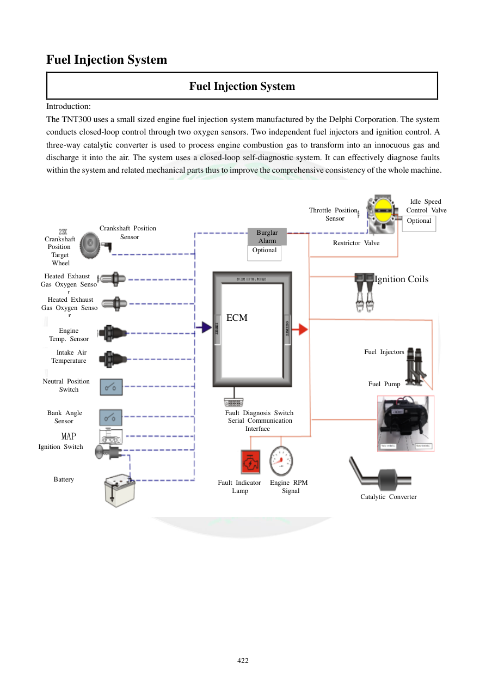

# Manual page 423

> Source: [page-0423.md](../source/page-0423.md)

## Page image / diagram

- [page-0423-img-01.png](../images/embedded/page-0423-img-01.png)

## Extracted text

# Source page 423

 
422 
Fuel Injection System 
Fuel Injection System 
Introduction: 
The TNT300 uses a small sized engine fuel injection system manufactured by the Delphi Corporation. The system 
conducts closed-loop control through two oxygen sensors. Two independent fuel injectors and ignition control. A 
three-way catalytic converter is used to process engine combustion gas to transform into an innocuous gas and 
discharge it into the air. The system uses a closed-loop self-diagnostic system. It can effectively diagnose faults 
within the system and related mechanical parts thus to improve the comprehensive consistency of the whole machine.  
 
 
 
 
Crankshaft 
Position  
 Target  
Wheel 
Burglar 
Alarm 
Throttle Position
 Sensor 
   Idle Speed  
  Control Valve 
Optional 
Optional 
Restrictor Valve 
Ignition Coils 
ECM 
Fuel Injectors 
 
 
 
Fuel Pump 
Fault Diagnosis Switch 
   Serial Communication    
        Interface 
Fault Indicator 
Lamp 
Engine RPM  
   Signal 
Catalytic Converter 
Crankshaft Position
 Sensor 
Heated Exhaust  
Gas Oxygen Senso
r
  Heated Exhaust  
Gas Oxygen Senso
r
Engine 
Temp. Sensor 
    Intake Air   
Temperature 
Neutral Position  
Switch 
   Bank Angle   
Sensor 
MAP 
Ignition Switch 
Battery

## Persian notes

### سیستم انژکتوری EFI
دفترچه، سیستم سوخت‌رسانی TNT300 را به‌عنوان سیستم انژکتوری ساخت **Delphi** معرفی می‌کند که کنترل حلقه‌بسته و خودعیب‌یابی دارد.

اجزای اصلی دیاگرام:
- سنسور موقعیت میل‌لنگ و چرخ هدف
- ECU/ECM
- دو انژکتور و دو کویل جرقه
- سنسور دریچه گاز TPS
- کنترل دور آرام
- پمپ بنزین
- سنسور دمای موتور
- سنسور دمای هوای ورودی
- سنسور MAP
- دو سنسور اکسیژن گرم‌شونده
- سنسور خلاص
- سنسور زاویه واژگونی
- سوئیچ استارت و باتری
- کاتالیزور و چراغ خطا

این صفحه **TNT300** را صراحتاً ذکر می‌کند، بنابراین نباید آرایش ECU و سیم‌کشی آن را بدون تطبیق به TNT249 نسبت داد.
