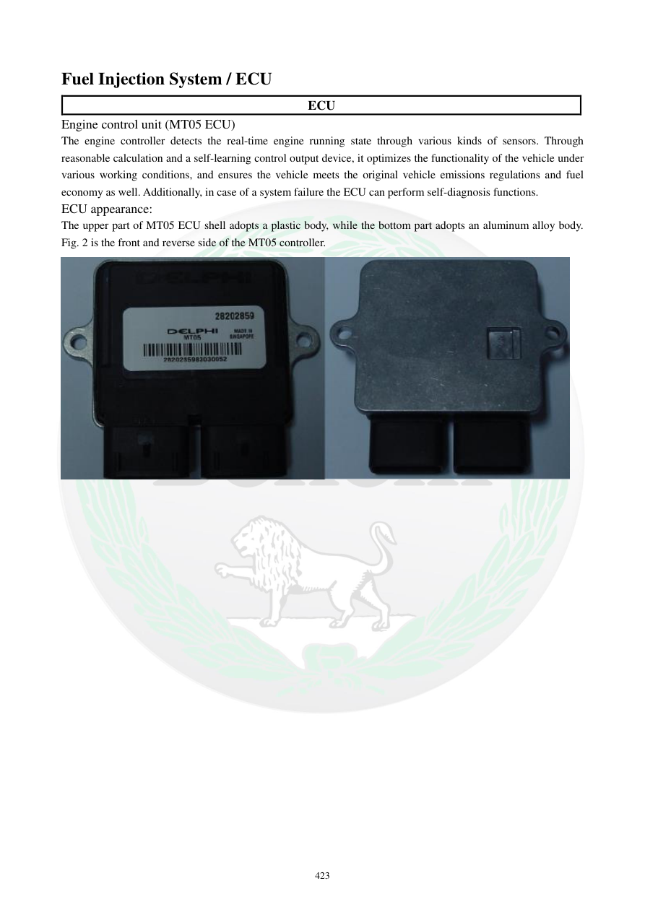

# Manual page 424

> Source: [page-0424.md](../source/page-0424.md)

## Page image / diagram

- [page-0424-img-01.jpeg](../images/embedded/page-0424-img-01.jpeg)

## Extracted text

# Source page 424

 
423 
Fuel Injection System / ECU 
ECU 
Engine control unit (MT05 ECU) 
The engine controller detects the real-time engine running state through various kinds of sensors. Through 
reasonable calculation and a self-learning control output device, it optimizes the functionality of the vehicle under 
various working conditions, and ensures the vehicle meets the original vehicle emissions regulations and fuel 
economy as well. Additionally, in case of a system failure the ECU can perform self-diagnosis functions.  
ECU appearance: 
The upper part of MT05 ECU shell adopts a plastic body, while the bottom part adopts an aluminum alloy body. 
Fig. 2 is the front and reverse side of the MT05 controller.

## Persian notes

<!-- Persian translation/explanation will be added here. -->
