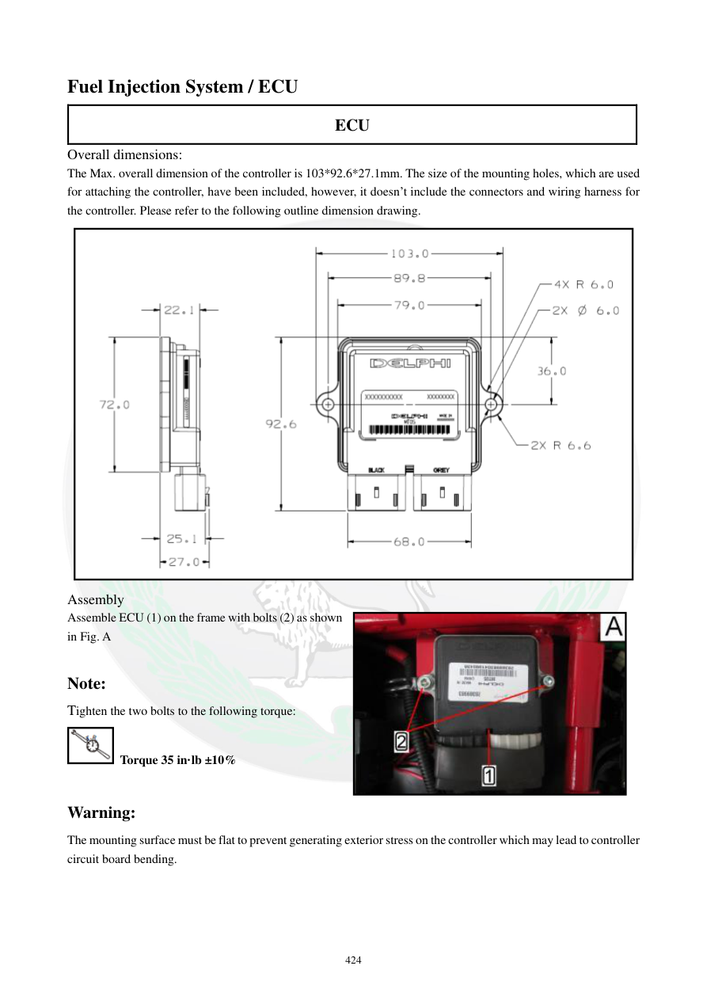

# Manual page 425

> Source: [page-0425.md](../source/page-0425.md)

## Page image / diagram

- [page-0425-img-02.jpeg](../images/embedded/page-0425-img-02.jpeg)

- [page-0425-img-04.png](../images/embedded/page-0425-img-04.png)

## Extracted text

# Source page 425

 
424 
Fuel Injection System / ECU 
ECU 
Overall dimensions:  
The Max. overall dimension of the controller is 103*92.6*27.1mm. The size of the mounting holes, which are used 
for attaching the controller, have been included, however, it doesn’t include the connectors and wiring harness for 
the controller. Please refer to the following outline dimension drawing. 
 
Assembly 
Assemble ECU (1) on the frame with bolts (2) as shown 
in Fig. A 
 
Note: 
Tighten the two bolts to the following torque: 
 Torque 35 in·lb ±10% 
 
Warning: 
The mounting surface must be flat to prevent generating exterior stress on the controller which may lead to controller 
circuit board bending.

## Persian notes

<!-- Persian translation/explanation will be added here. -->
