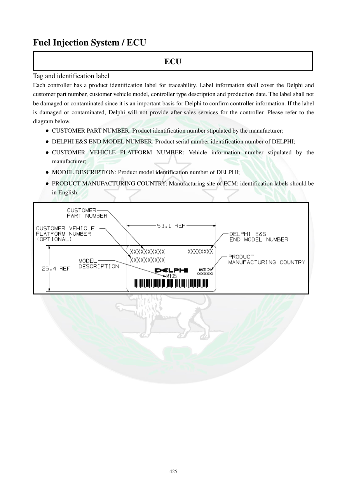

# Manual page 426

> Source: [page-0426.md](../source/page-0426.md)

## Page image / diagram

- [page-0426-img-01.png](../images/embedded/page-0426-img-01.png)

## Extracted text

# Source page 426

 
425 
Fuel Injection System / ECU 
ECU 
Tag and identification label  
Each controller has a product identification label for traceability. Label information shall cover the Delphi and 
customer part number, customer vehicle model, controller type description and production date. The label shall not 
be damaged or contaminated since it is an important basis for Delphi to confirm controller information. If the label 
is damaged or contaminated, Delphi will not provide after-sales services for the controller. Please refer to the 
diagram below.  
● CUSTOMER PART NUMBER: Product identification number stipulated by the manufacturer;  
● DELPHI E&S END MODEL NUMBER: Product serial number identification number of DELPHI; 
● CUSTOMER VEHICLE PLATFORM NUMBER: Vehicle information number stipulated by the 
manufacturer;  
● MODEL DESCRIPTION: Product model identification number of DELPHI; 
● PRODUCT MANUFACTURING COUNTRY: Manufacturing site of ECM; identification labels should be 
in English.

## Persian notes

<!-- Persian translation/explanation will be added here. -->
