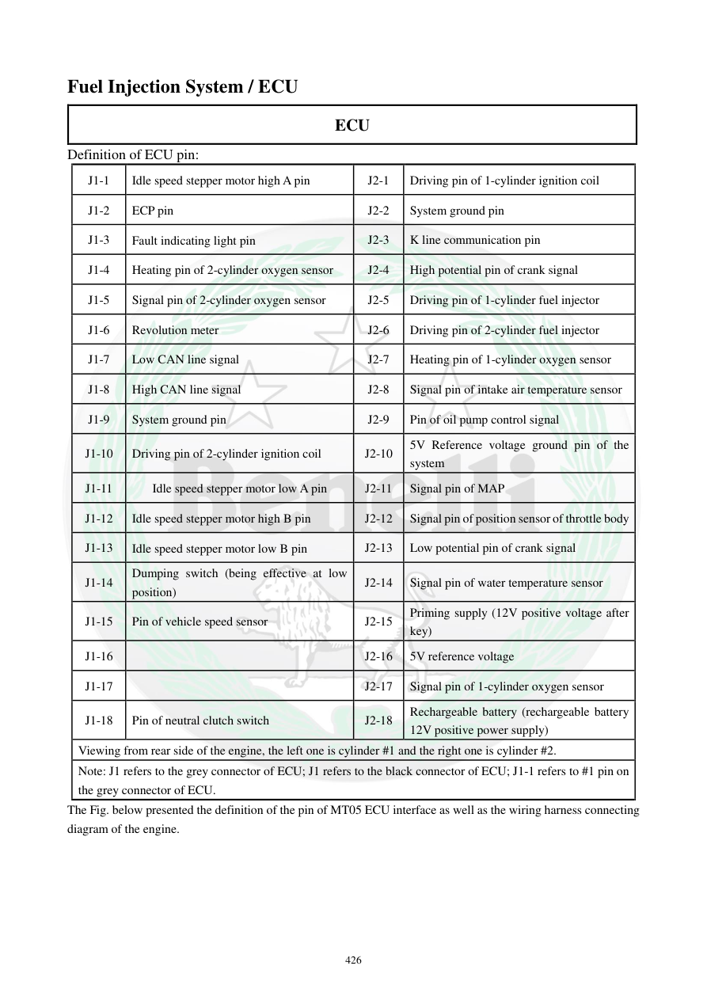

# Manual page 427

> Source: [page-0427.md](../source/page-0427.md)

## Page image / diagram

## Extracted text

# Source page 427

 
426 
Fuel Injection System / ECU 
ECU 
Definition of ECU pin: 
J1-1 
Idle speed stepper motor high A pin 
J2-1 
Driving pin of 1-cylinder ignition coil 
J1-2 
ECP pin 
J2-2 
System ground pin 
J1-3 
Fault indicating light pin 
J2-3 
K line communication pin 
J1-4 
Heating pin of 2-cylinder oxygen sensor 
J2-4 
High potential pin of crank signal  
J1-5 
Signal pin of 2-cylinder oxygen sensor 
J2-5 
Driving pin of 1-cylinder fuel injector 
J1-6 
Revolution meter 
J2-6 
Driving pin of 2-cylinder fuel injector 
J1-7 
Low CAN line signal 
J2-7 
Heating pin of 1-cylinder oxygen sensor 
J1-8 
High CAN line signal 
J2-8 
Signal pin of intake air temperature sensor 
J1-9 
System ground pin 
J2-9 
Pin of oil pump control signal 
J1-10 
Driving pin of 2-cylinder ignition coil 
J2-10 
5V Reference voltage ground pin of the 
system 
J1-11 
Idle speed stepper motor low A pin 
J2-11 
Signal pin of MAP 
J1-12 
Idle speed stepper motor high B pin 
J2-12 
Signal pin of position sensor of throttle body 
J1-13 
Idle speed stepper motor low B pin 
J2-13 
Low potential pin of crank signal 
J1-14 
Dumping switch (being effective at low 
position) 
J2-14 
Signal pin of water temperature sensor 
J1-15 
Pin of vehicle speed sensor 
J2-15 
Priming supply (12V positive voltage after 
key) 
J1-16 
 
J2-16 
5V reference voltage 
J1-17 
 
J2-17 
Signal pin of 1-cylinder oxygen sensor 
J1-18 
Pin of neutral clutch switch 
J2-18 
Rechargeable battery (rechargeable battery 
12V positive power supply)  
Viewing from rear side of the engine, the left one is cylinder #1 and the right one is cylinder #2.  
Note: J1 refers to the grey connector of ECU; J1 refers to the black connector of ECU; J1-1 refers to #1 pin on 
the grey connector of ECU.  
The Fig. below presented the definition of the pin of MT05 ECU interface as well as the wiring harness connecting 
diagram of the engine.

## Persian notes

### تعریف پایه‌های ECU و دیاگرام سیم‌کشی
صفحه، تعریف پایه‌های دو کانکتور ECU یعنی **J1 و J2** را ارائه می‌کند.

نمونه پایه‌های مهم:
- J1-1 تا J1-13: مدار استپر دور آرام
- J1-3: چراغ خطا
- J1-6: دورسنج
- J1-7/J1-8: خطوط CAN Low/High
- J1-14: سنسور زاویه واژگونی
- J1-15: سنسور سرعت
- J1-18: کلید خلاص/کلاچ
- J2-1/J2-10: فرمان کویل‌های سیلندرها
- J2-5/J2-6: فرمان انژکتورهای سیلندر 1 و 2
- J2-4/J2-13: سیگنال‌های High/Low سنسور موقعیت میل‌لنگ
- J2-8: سنسور دمای هوای ورودی
- J2-11: سنسور MAP
- J2-12: سنسور موقعیت دریچه گاز
- J2-14: سنسور دمای آب
- J2-15: تغذیه 12V پس از سوئیچ
- J2-16: مرجع 5V
- J2-18: تغذیه مثبت 12V باتری

**نکته مهم:** متن دفترچه در انتهای صفحه یک خطای واضح دارد و برای J1/J2 نام کانکتورها را متناقض بیان می‌کند. تعریف پایه‌ها و شکل کانکتورها باید از **تصویر/دیاگرام صفحه** خوانده شود، نه از همان جمله OCRشده.

همچنین دفترچه می‌گوید از پشت موتور، سیلندر سمت چپ **#1** و سمت راست **#2** است. این بخش در متن با مشخصات ECU/MT05 همان سیستم ارائه‌شده در دفترچه مرتبط است و برای TNT249 باید با کانکتور و ECU واقعی تطبیق شود.
