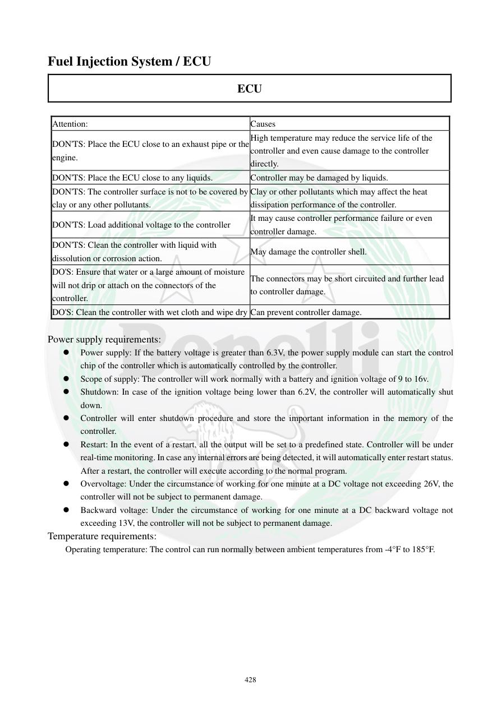

# Manual page 429

> Source: [page-0429.md](../source/page-0429.md)

## Page image / diagram

## Extracted text

# Source page 429

 
428 
Fuel Injection System / ECU 
ECU 
 
Attention:  
Causes 
DON'TS: Place the ECU close to an exhaust pipe or the 
engine. 
High temperature may reduce the service life of the 
controller and even cause damage to the controller 
directly. 
DON'TS: Place the ECU close to any liquids. 
Controller may be damaged by liquids. 
DON'TS: The controller surface is not to be covered by 
clay or any other pollutants. 
Clay or other pollutants which may affect the heat 
dissipation performance of the controller. 
DON'TS: Load additional voltage to the controller 
It may cause controller performance failure or even 
controller damage. 
DON'TS: Clean the controller with liquid with 
dissolution or corrosion action. 
May damage the controller shell. 
DO'S: Ensure that water or a large amount of moisture 
will not drip or attach on the connectors of the 
controller. 
The connectors may be short circuited and further lead 
to controller damage. 
DO'S: Clean the controller with wet cloth and wipe dry Can prevent controller damage. 
 
Power supply requirements: 
 
Power supply: If the battery voltage is greater than 6.3V, the power supply module can start the control 
chip of the controller which is automatically controlled by the controller.  
 
Scope of supply: The controller will work normally with a battery and ignition voltage of 9 to 16v.  
 
Shutdown: In case of the ignition voltage being lower than 6.2V, the controller will automatically shut 
down. 
 
Controller will enter shutdown procedure and store the important information in the memory of the 
controller.  
 
Restart: In the event of a restart, all the output will be set to a predefined state. Controller will be under 
real-time monitoring. In case any internal errors are being detected, it will automatically enter restart status. 
After a restart, the controller will execute according to the normal program.  
 
Overvoltage: Under the circumstance of working for one minute at a DC voltage not exceeding 26V, the 
controller will not be subject to permanent damage.  
 
Backward voltage: Under the circumstance of working for one minute at a DC backward voltage not 
exceeding 13V, the controller will not be subject to permanent damage.  
Temperature requirements: 
Operating temperature: The control can run normally between ambient temperatures from -4°F to 185°F.

## Persian notes

### نکات حفاظتی و شرایط کاری ECU
- ECU را نزدیک اگزوز یا موتور و منابع حرارت زیاد نصب نکنید؛ گرما عمر و عملکرد آن را کاهش می‌دهد.
- از تماس ECU با مایعات جلوگیری کنید و سطح آن را با گل یا آلودگی نپوشانید تا دفع حرارت مختل نشود.
- ولتاژ اضافی به ECU اعمال نکنید و برای تمیزکردن از مایعات خورنده/حلال‌های نامناسب استفاده نکنید.
- اجازه ندهید آب یا رطوبت زیاد وارد کانکتورها شود؛ احتمال اتصال کوتاه وجود دارد.
- تمیزکاری بیرونی با پارچه مرطوب و سپس خشک‌کردن توصیه شده است.
- بازه عملکرد تغذیه اعلام‌شده: **9 تا 16 V**.
- در ولتاژ پایین‌تر از حدود **6.2 V** ECU وارد خاموشی می‌شود؛ متن می‌گوید در بالاتر از **6.3 V** بخش تغذیه می‌تواند کنترلر را راه‌اندازی کند.
- دفترچه تحمل **26 V DC حداکثر برای 1 دقیقه** را بدون آسیب دائمی ذکر می‌کند، اما این به معنی مجاز بودن چنین ولتاژی در استفاده عادی نیست.
- دمای محیط کاری: حدود **4- تا 185°F، یعنی 20- تا 85°C**.
