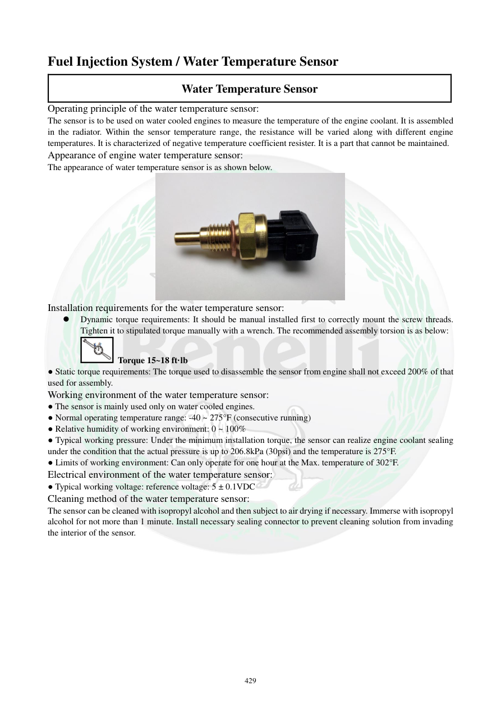

# Manual page 430

> Source: [page-0430.md](../source/page-0430.md)

## Page image / diagram

- [page-0430-img-02.jpeg](../images/embedded/page-0430-img-02.jpeg)

## Extracted text

# Source page 430

 
429 
Fuel Injection System / Water Temperature Sensor 
Water Temperature Sensor 
Operating principle of the water temperature sensor: 
The sensor is to be used on water cooled engines to measure the temperature of the engine coolant. It is assembled 
in the radiator. Within the sensor temperature range, the resistance will be varied along with different engine 
temperatures. It is characterized of negative temperature coefficient resister. It is a part that cannot be maintained.  
Appearance of engine water temperature sensor: 
The appearance of water temperature sensor is as shown below. 
 
Installation requirements for the water temperature sensor: 
 
Dynamic torque requirements: It should be manual installed first to correctly mount the screw threads. 
Tighten it to stipulated torque manually with a wrench. The recommended assembly torsion is as below:  
 Torque 15~18 ft·lb 
● Static torque requirements: The torque used to disassemble the sensor from engine shall not exceed 200% of that 
used for assembly.  
Working environment of the water temperature sensor: 
● The sensor is mainly used only on water cooled engines. 
● Normal operating temperature range: -40 ~ 275°F (consecutive running) 
● Relative humidity of working environment: 0 ~ 100% 
● Typical working pressure: Under the minimum installation torque, the sensor can realize engine coolant sealing 
under the condition that the actual pressure is up to 206.8kPa (30psi) and the temperature is 275°F.  
● Limits of working environment: Can only operate for one hour at the Max. temperature of 302°F.  
Electrical environment of the water temperature sensor: 
● Typical working voltage: reference voltage: 5 ± 0.1VDC 
Cleaning method of the water temperature sensor: 
The sensor can be cleaned with isopropyl alcohol and then subject to air drying if necessary. Immerse with isopropyl 
alcohol for not more than 1 minute. Install necessary sealing connector to prevent cleaning solution from invading 
the interior of the sensor.

## Persian notes

<!-- Persian translation/explanation will be added here. -->
