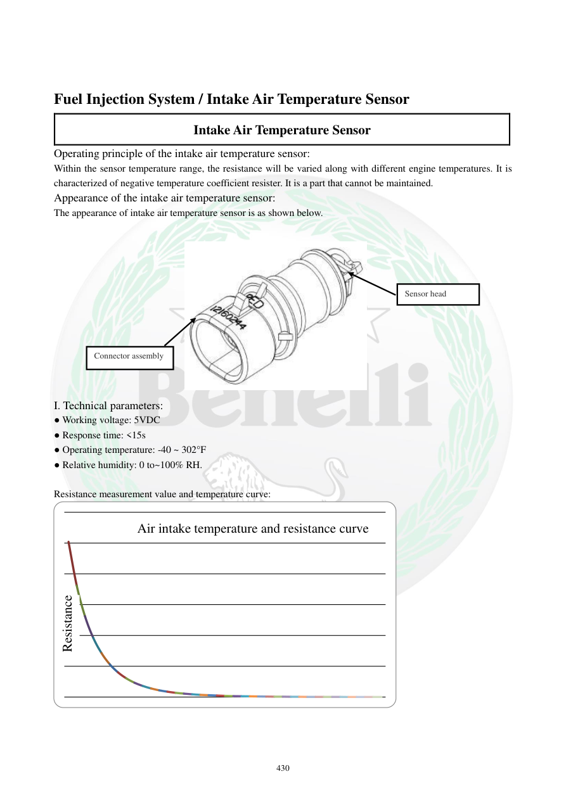

# Manual page 431

> Source: [page-0431.md](../source/page-0431.md)

## Page image / diagram

- [page-0431-img-01.jpeg](../images/embedded/page-0431-img-01.jpeg)

- [page-0431-img-02.png](../images/embedded/page-0431-img-02.png)

- [page-0431-img-03.png](../images/embedded/page-0431-img-03.png)

## Extracted text

# Source page 431

 
430 
 
Fuel Injection System / Intake Air Temperature Sensor 
Intake Air Temperature Sensor 
Operating principle of the intake air temperature sensor: 
Within the sensor temperature range, the resistance will be varied along with different engine temperatures. It is 
characterized of negative temperature coefficient resister. It is a part that cannot be maintained.  
Appearance of the intake air temperature sensor: 
The appearance of intake air temperature sensor is as shown below. 
 
 
I. Technical parameters: 
● Working voltage: 5VDC 
● Response time: <15s 
● Operating temperature: -40 ~ 302°F  
● Relative humidity: 0 to~100% RH.  
 
Resistance measurement value and temperature curve: 
 
 
 
电阻
进气温度与电阻曲线
Connector assembly 
Sensor head 
Air intake temperature and resistance curve 
Resistance

## Persian notes

<!-- Persian translation/explanation will be added here. -->
