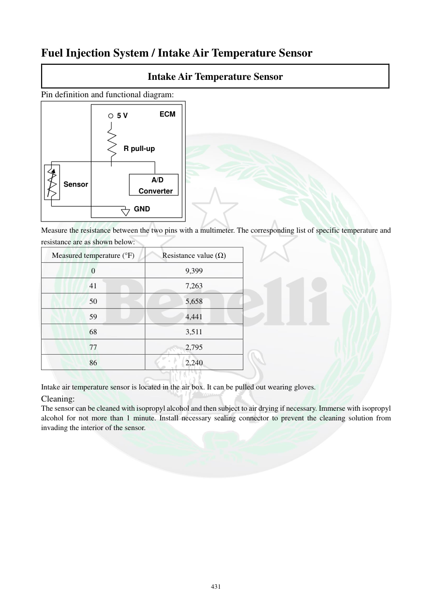

# Manual page 432

> Source: [page-0432.md](../source/page-0432.md)

## Page image / diagram

- [page-0432-img-01.png](../images/embedded/page-0432-img-01.png)

- [page-0432-img-02.png](../images/embedded/page-0432-img-02.png)

- [page-0432-img-03.png](../images/embedded/page-0432-img-03.png)

- [page-0432-img-04.png](../images/embedded/page-0432-img-04.png)

- [page-0432-img-05.png](../images/embedded/page-0432-img-05.png)

- [page-0432-img-06.png](../images/embedded/page-0432-img-06.png)

## Extracted text

# Source page 432

 
431 
Fuel Injection System / Intake Air Temperature Sensor 
Intake Air Temperature Sensor 
Pin definition and functional diagram: 
 
Measure the resistance between the two pins with a multimeter. The corresponding list of specific temperature and 
resistance are as shown below: 
Measured temperature (°F) 
Resistance value (Ω) 
0 
9,399 
41 
7,263 
50 
5,658 
59 
4,441 
68 
3,511 
77 
2,795 
86 
2,240 
 
Intake air temperature sensor is located in the air box. It can be pulled out wearing gloves.  
Cleaning: 
The sensor can be cleaned with isopropyl alcohol and then subject to air drying if necessary. Immerse with isopropyl 
alcohol for not more than 1 minute. Install necessary sealing connector to prevent the cleaning solution from 
invading the interior of the sensor.  
 
 
 
Sensor 
GND 
    A/D 
Converter 
R pull-up 
5 V 
ECM

## Persian notes

<!-- Persian translation/explanation will be added here. -->
