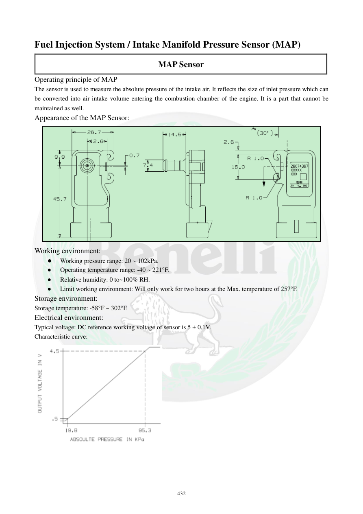

# Manual page 433

> Source: [page-0433.md](../source/page-0433.md)

## Page image / diagram

- [page-0433-img-01.png](../images/embedded/page-0433-img-01.png)

- [page-0433-img-02.png](../images/embedded/page-0433-img-02.png)

## Extracted text

# Source page 433

 
432 
Fuel Injection System / Intake Manifold Pressure Sensor (MAP) 
MAP Sensor 
Operating principle of MAP 
The sensor is used to measure the absolute pressure of the intake air. It reflects the size of inlet pressure which can 
be converted into air intake volume entering the combustion chamber of the engine. It is a part that cannot be 
maintained as well.  
Appearance of the MAP Sensor: 
 
Working environment: 
● 
Working pressure range: 20 ~ 102kPa. 
● 
Operating temperature range: -40 ~ 221°F. 
● 
Relative humidity: 0 to~100% RH.  
● 
Limit working environment: Will only work for two hours at the Max. temperature of 257°F.  
Storage environment:  
Storage temperature: -58°F ~ 302°F. 
Electrical environment:  
Typical voltage: DC reference working voltage of sensor is 5 ± 0.1V.  
Characteristic curve:

## Persian notes

### سنسور فشار مطلق منیفولد، MAP
- MAP فشار مطلق هوای ورودی را اندازه می‌گیرد و ECU از آن برای برآورد مقدار هوای واردشده به محفظه احتراق استفاده می‌کند.
- این سنسور قابل تعمیر داخلی نیست.
- محدوده فشار کاری: **20 تا 102 kPa**.
- دمای کاری: **40- تا 221°F، حدود 40- تا 105°C**.
- رطوبت نسبی: 0 تا 100٪.
- در دمای حداکثر **257°F (حدود 125°C)** فقط برای مدت محدود طبق دفترچه قابل استفاده است.
- دمای نگهداری: **58- تا 302°F، حدود 50- تا 150°C**.
- ولتاژ مرجع معمول: **5 ±0.1 VDC**.
- برای منحنی دقیق خروجی MAP، تصویر/نمودار اصلی صفحه مرجع است.
