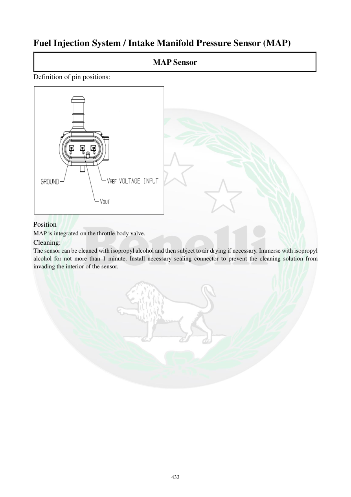

# Manual page 434

> Source: [page-0434.md](../source/page-0434.md)

## Page image / diagram

- [page-0434-img-01.png](../images/embedded/page-0434-img-01.png)

## Extracted text

# Source page 434

 
433 
Fuel Injection System / Intake Manifold Pressure Sensor (MAP) 
MAP Sensor 
Definition of pin positions: 
 
Position 
MAP is integrated on the throttle body valve.  
Cleaning: 
The sensor can be cleaned with isopropyl alcohol and then subject to air drying if necessary. Immerse with isopropyl 
alcohol for not more than 1 minute. Install necessary sealing connector to prevent the cleaning solution from 
invading the interior of the sensor.

## Persian notes

### MAP و محل نصب
- صفحه ادامه تعریف پایه‌ها و مشخصات MAP است، اما جدول پایه‌ها در استخراج متن کامل نشده است.
- MAP طبق دفترچه **روی مجموعه دریچه گاز (Throttle Body)** یکپارچه شده است.
- برای تمیزکاری، در صورت نیاز ایزوپروپیل الکل حداکثر 1 دقیقه استفاده و سپس سنسور با هوا خشک شود.
- از ورود محلول به داخل سنسور جلوگیری کنید.
- برای تشخیص پایه سیگنال، تغذیه و زمین، به **دیاگرام تصویری همین صفحه** مراجعه شود، چون متن استخراج‌شده جایگاه پایه‌ها را کامل نشان نمی‌دهد.
