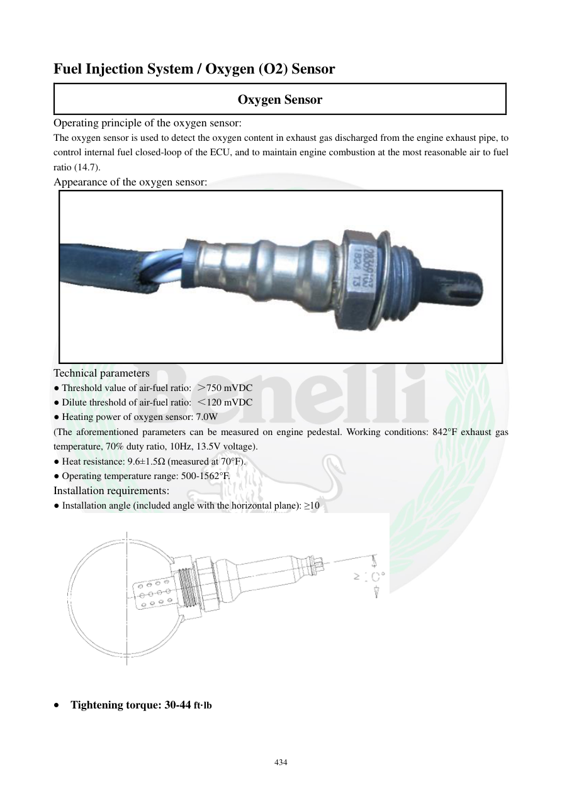

# Manual page 435

> Source: [page-0435.md](../source/page-0435.md)

## Page image / diagram

- [page-0435-img-01.jpeg](../images/embedded/page-0435-img-01.jpeg)

- [page-0435-img-03.png](../images/embedded/page-0435-img-03.png)

## Extracted text

# Source page 435

 
434 
Fuel Injection System / Oxygen (O2) Sensor 
Oxygen Sensor 
Operating principle of the oxygen sensor: 
The oxygen sensor is used to detect the oxygen content in exhaust gas discharged from the engine exhaust pipe, to 
control internal fuel closed-loop of the ECU, and to maintain engine combustion at the most reasonable air to fuel 
ratio (14.7).  
Appearance of the oxygen sensor: 
 
Technical parameters 
● Threshold value of air-fuel ratio: ＞750 mVDC 
● Dilute threshold of air-fuel ratio: ＜120 mVDC 
● Heating power of oxygen sensor: 7.0W 
(The aforementioned parameters can be measured on engine pedestal. Working conditions: 842°F exhaust gas 
temperature, 70% duty ratio, 10Hz, 13.5V voltage).  
● Heat resistance: 9.6±1.5Ω (measured at 70°F). 
● Operating temperature range: 500-1562°F. 
Installation requirements: 
● Installation angle (included angle with the horizontal plane): ≥10 
 
 Tightening torque: 30-44 ft·lb

## Persian notes

<!-- Persian translation/explanation will be added here. -->
