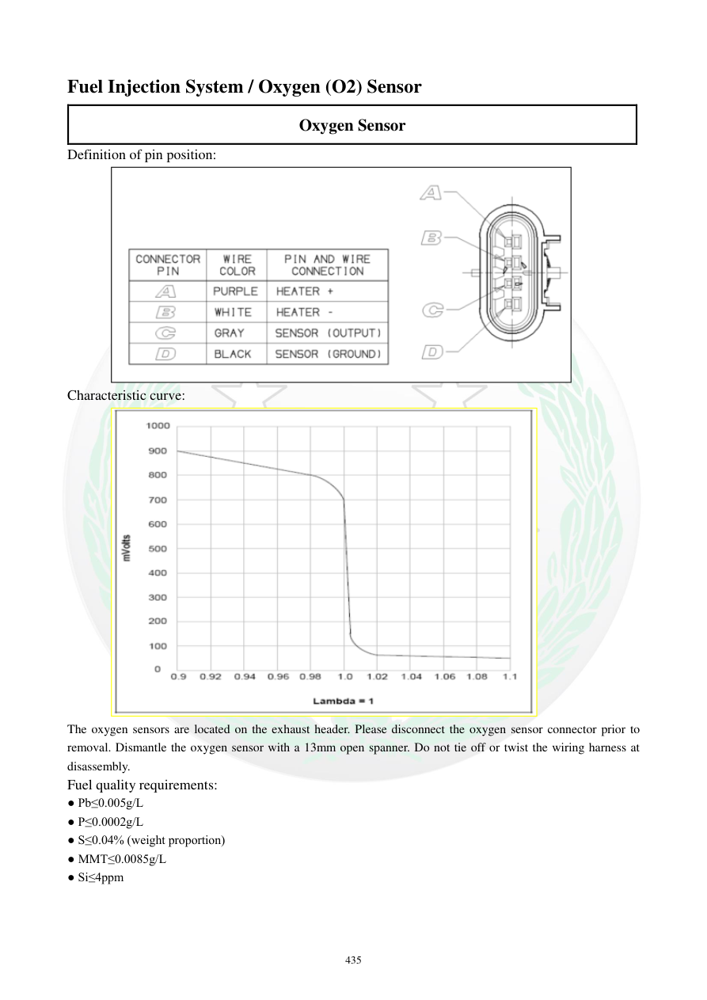

# Manual page 436

> Source: [page-0436.md](../source/page-0436.md)

## Page image / diagram

- [page-0436-img-01.png](../images/embedded/page-0436-img-01.png)

- [page-0436-img-02.png](../images/embedded/page-0436-img-02.png)

## Extracted text

# Source page 436

 
435 
Fuel Injection System / Oxygen (O2) Sensor 
Oxygen Sensor 
Definition of pin position: 
 
Characteristic curve: 
 
The oxygen sensors are located on the exhaust header. Please disconnect the oxygen sensor connector prior to 
removal. Dismantle the oxygen sensor with a 13mm open spanner. Do not tie off or twist the wiring harness at 
disassembly.  
Fuel quality requirements: 
● Pb≤0.005g/L 
● P≤0.0002g/L 
● S≤0.04% (weight proportion) 
● MMT≤0.0085g/L 
● Si≤4ppm

## Persian notes

### بازکردن و شرایط سوخت سنسور O2
- سنسورهای اکسیژن روی **هدر اگزوز** قرار دارند.
- قبل از بازکردن، کانکتور سنسور را جدا کنید.
- برای بازکردن از آچار تخت **13 mm** استفاده شود.
- سیم‌کشی را هنگام بازکردن نپیچانید و تحت کشش قرار ندهید.
- مشخصات کیفی سوخت اعلام‌شده در صفحه:
  - Pb ≤ **0.005 g/L**
  - P ≤ **0.0002 g/L**
  - S ≤ **0.04٪ وزنی**
  - MMT ≤ **0.0085 g/L**
  - Si ≤ **4 ppm**
- برای منحنی مشخصه و تعریف پایه‌ها، تصویر صفحه مرجع اصلی است.
