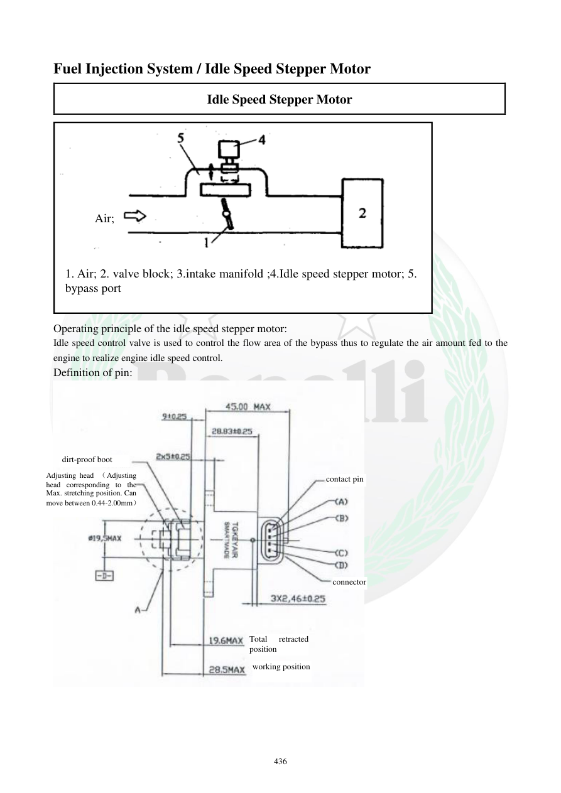

# Manual page 437

> Source: [page-0437.md](../source/page-0437.md)

## Page image / diagram

- [page-0437-img-01.png](../images/embedded/page-0437-img-01.png)

- [page-0437-img-02.jpeg](../images/embedded/page-0437-img-02.jpeg)

## Extracted text

# Source page 437

 
436 
Fuel Injection System / Idle Speed Stepper Motor 
Idle Speed Stepper Motor 
 
Operating principle of the idle speed stepper motor: 
Idle speed control valve is used to control the flow area of the bypass thus to regulate the air amount fed to the 
engine to realize engine idle speed control.  
Definition of pin: 
 
 
 
1. Air; 2. valve block; 3.intake manifold ;4.Idle speed stepper motor; 5. 
bypass port 
dirt-proof boot 
Adjusting head （Adjusting 
head corresponding to the 
Max. stretching position. Can 
move between 0.44-2.00mm） 
connector 
Total 
retracted 
position 
working position 
contact pin 
Air;

## Persian notes

<!-- Persian translation/explanation will be added here. -->
