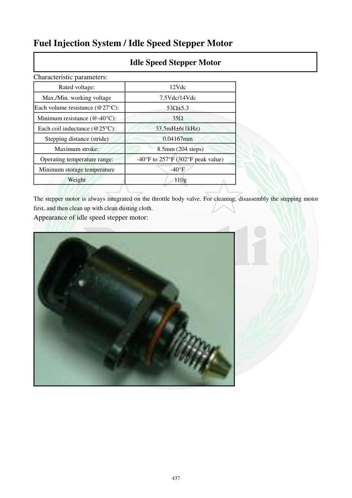

# Manual page 438

> Source: [page-0438.md](../source/page-0438.md)

## Page image / diagram

- [page-0438-img-02.jpeg](../images/embedded/page-0438-img-02.jpeg)

## Extracted text

# Source page 438

 
437 
Fuel Injection System / Idle Speed Stepper Motor 
Idle Speed Stepper Motor 
Characteristic parameters: 
Rated voltage: 
12Vdc 
Max./Min. working voltage 
7.5Vdc/14Vdc 
Each volume resistance (@27°C): 
53W±5.3 
Minimum resistance (@-40°C): 
35W 
Each coil inductance (@25°C): 
33.5mH±6(1kHz) 
Stepping distance (stride) 
0.04167mm 
Maximum stroke: 
8.5mm (204 steps) 
Operating temperature range: 
-40°F to 257°F (302°F peak value) 
Minimum storage temperature 
-40°F 
Weight 
110g 
 
The stepper motor is always integrated on the throttle body valve. For cleaning, disassembly the stepping motor 
first, and then clean up with clean dusting cloth.  
Appearance of idle speed stepper motor:

## Persian notes

### موتور پله‌ای دور آرام (Idle Speed Stepper Motor)
این موتور روی مجموعه دریچه گاز یکپارچه شده و مقدار هوای بای‌پس موردنیاز دور آرام را کنترل می‌کند.

**پارامترهای سرویس طبق صفحه:**
- ولتاژ نامی: 12V DC
- محدوده ولتاژ کاری: 7.5 تا 14V DC
- مقاومت هر بخش سیم‌پیچ در 27°C: 53±5.3Ω
- حداقل مقاومت در -40°C: 35Ω
- اندوکتانس هر سیم‌پیچ در 25°C: 33.5±6 mH در 1kHz
- گام حرکت: 0.04167 mm
- کورس حداکثر: 8.5 mm، معادل 204 گام
- دمای کاری: -40 تا 257°F، با پیک 302°F
- حداقل دمای نگهداری: -40°F
- وزن: 110g

**تمیزکاری:** طبق متن منبع ابتدا موتور پله‌ای از مجموعه باز شود و سپس با پارچه تمیز و بدون گردوغبار تمیزکاری انجام شود. برای محل دقیق قطعه و نحوه قرارگیری، تصویر صفحه مرجع اصلی است.
