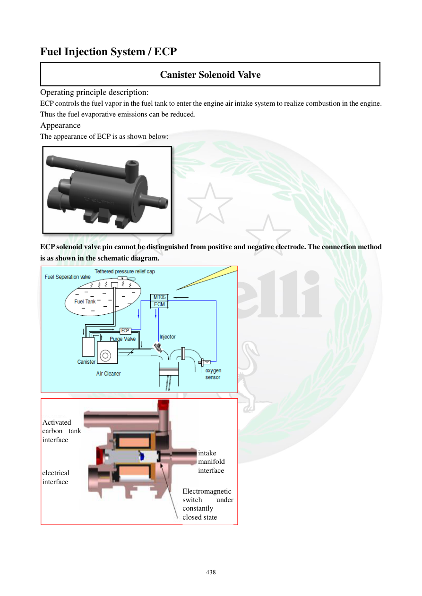

# Manual page 439

> Source: [page-0439.md](../source/page-0439.md)

## Page image / diagram

- [page-0439-img-01.png](../images/embedded/page-0439-img-01.png)

- [page-0439-img-02.png](../images/embedded/page-0439-img-02.png)

- [page-0439-img-03.jpeg](../images/embedded/page-0439-img-03.jpeg)

- [page-0439-img-05.jpeg](../images/embedded/page-0439-img-05.jpeg)

## Extracted text

# Source page 439

 
438 
Fuel Injection System / ECP 
Canister Solenoid Valve 
Operating principle description: 
ECP controls the fuel vapor in the fuel tank to enter the engine air intake system to realize combustion in the engine. 
Thus the fuel evaporative emissions can be reduced.  
Appearance 
The appearance of ECP is as shown below: 
 
ECP solenoid valve pin cannot be distinguished from positive and negative electrode. The connection method 
is as shown in the schematic diagram.  
 
 
 
 
Activated 
carbon tank 
interface 
electrical 
interface 
intake 
manifold 
interface 
Electromagnetic 
switch 
under 
constantly 
closed state

## Persian notes

<!-- Persian translation/explanation will be added here. -->
