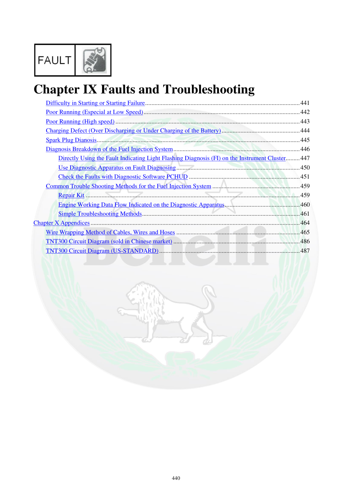

# Manual page 441

> Source: [page-0441.md](../source/page-0441.md)

## Page image / diagram

## Extracted text

# Source page 441

 
440 
 
 
Chapter IX Faults and Troubleshooting 
Difficulty in Starting or Starting Failure ................................................................................................... 441 
Poor Running (Especial at Low Speed) .................................................................................................... 442 
Poor Running (High speed) ...................................................................................................................... 443 
Charging Defect (Over Discharging or Under Charging of the Battery) .................................................. 444 
Spark Plug Dianosis .................................................................................................................................. 445 
Diagnosis Breakdown of the Fuel Injection System ................................................................................. 446 
Directly Using the Fault Indicating Light Flashing Diagnosis (FI) on the Instrument Cluster ......... 447 
Use Diagnostic Apparatus on Fault Diagnosing ............................................................................... 450 
Check the Faults with Diagnostic Software PCHUD ....................................................................... 451 
Common Trouble Shooting Methods for the Fuel Injection System ........................................................ 459 
Repair Kit ......................................................................................................................................... 459 
Engine Working Data Flow Indicated on the Diagnostic Apparatus ................................................ 460 
Simple Troubleshooting Methods ..................................................................................................... 461 
Chapter X Appendices ...................................................................................................................................... 464 
Wire Wrapping Method of Cables, Wires and Hoses ............................................................................... 465 
TNT300 Circuit Diagram (sold in Chinese market) ................................................................................. 486 
TNT300 Circuit Diagram (US-STANDARD) .......................................................................................... 487

## Persian notes

<!-- Persian translation/explanation will be added here. -->
