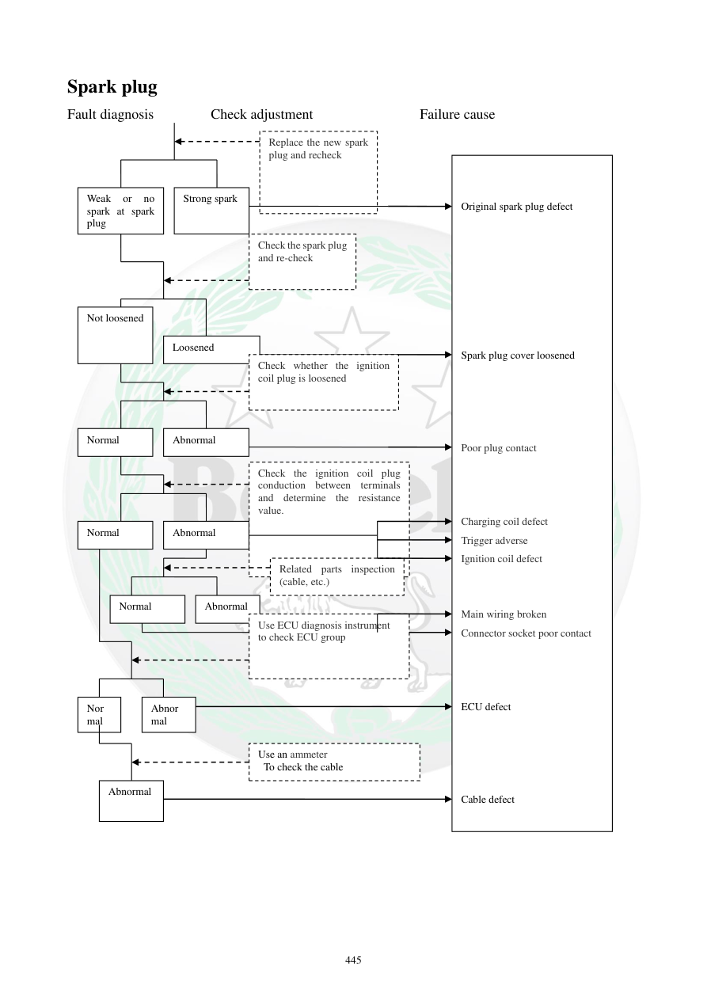

# Manual page 446

> Source: [page-0446.md](../source/page-0446.md)

## Page image / diagram

- [page-0446-img-05.png](../images/embedded/page-0446-img-05.png)

- [page-0446-img-06.png](../images/embedded/page-0446-img-06.png)

- [page-0446-img-07.png](../images/embedded/page-0446-img-07.png)

- [page-0446-img-08.png](../images/embedded/page-0446-img-08.png)

- [page-0446-img-09.png](../images/embedded/page-0446-img-09.png)

- [page-0446-img-10.png](../images/embedded/page-0446-img-10.png)

- [page-0446-img-11.png](../images/embedded/page-0446-img-11.png)

- [page-0446-img-12.png](../images/embedded/page-0446-img-12.png)

- [page-0446-img-13.png](../images/embedded/page-0446-img-13.png)

- [page-0446-img-14.png](../images/embedded/page-0446-img-14.png)

- [page-0446-img-15.png](../images/embedded/page-0446-img-15.png)

- [page-0446-img-16.png](../images/embedded/page-0446-img-16.png)

- [page-0446-img-17.png](../images/embedded/page-0446-img-17.png)

- [page-0446-img-18.png](../images/embedded/page-0446-img-18.png)

## Extracted text

# Source page 446

 
445 
Spark plug 
Fault diagnosis        Check adjustment               Failure cause 
 
 
 
 
Weak 
or 
no 
spark at spark 
plug  
Strong spark 
Replace the new spark 
plug and recheck 
Not loosened 
Loosened 
Check the spark plug 
and re-check 
Normal 
Abnormal 
Check the ignition coil plug 
conduction between terminals 
and determine the resistance 
value. 
Normal 
Abnormal 
Abnormal 
Normal 
Related parts inspection 
(cable, etc.) 
Check whether the ignition 
coil plug is loosened  
Nor
mal 
Abnor
mal 
Abnormal 
 
Use an ammeter 
 To check the cable 
Use ECU diagnosis instrument 
to check ECU group 
 
 
 
Original spark plug defect 
 
 
 
 
 
 
 
Spark plug cover loosened 
 
 
 
 
Poor plug contact  
 
 
 
Charging coil defect 
Trigger adverse 
Ignition coil defect 
 
 
Main wiring broken 
Connector socket poor contact 
 
 
 
ECU defect 
 
 
 
 
Cable defect

## Persian notes

### عیب‌یابی شمع و سیستم جرقه
اگر جرقه شمع ضعیف یا وجود نداشته باشد، فلوچارت این مراحل را پیشنهاد می‌کند:

1. شمع را بررسی و در صورت نیاز با شمع سالم جایگزین و دوباره آزمایش کنید.
2. محکم بودن کلاهک/اتصال شمع را بررسی کنید.
3. اتصال و رسانایی سوکت کویل احتراق و مقاومت آن را طبق مشخصات سرویس بررسی کنید.
4. سیم‌ها و اتصالات مرتبط را بررسی کنید.
5. سوکت کویل از نظر شل بودن یا تماس نامناسب بررسی شود.
6. مدار سیم‌کشی اصلی، سوکت‌ها و کابل‌ها بررسی شوند.
7. در صورت نیاز با ابزار تشخیص ECU، گروه ECU بررسی شود.

علت‌های ذکرشده در فلوچارت شامل خرابی شمع، اتصال بد، خرابی سیم‌پیچ شارژ، Trigger، کویل احتراق، سیم‌کشی اصلی، سوکت‌ها و ECU است.
