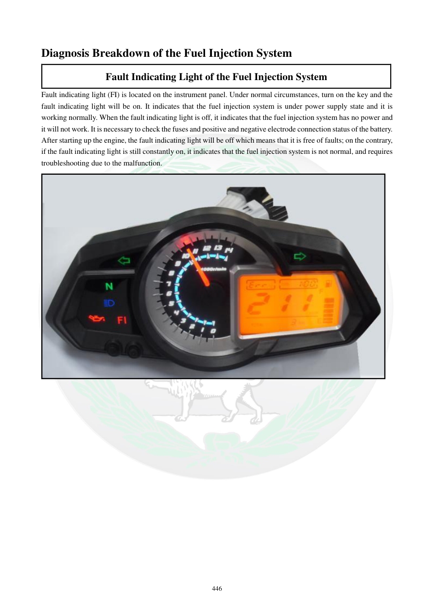

# Manual page 447

> Source: [page-0447.md](../source/page-0447.md)

## Page image / diagram

- [page-0447-img-01.jpeg](../images/embedded/page-0447-img-01.jpeg)

## Extracted text

# Source page 447

 
446 
Diagnosis Breakdown of the Fuel Injection System 
Fault Indicating Light of the Fuel Injection System 
Fault indicating light (FI) is located on the instrument panel. Under normal circumstances, turn on the key and the 
fault indicating light will be on. It indicates that the fuel injection system is under power supply state and it is 
working normally. When the fault indicating light is off, it indicates that the fuel injection system has no power and 
it will not work. It is necessary to check the fuses and positive and negative electrode connection status of the battery. 
After starting up the engine, the fault indicating light will be off which means that it is free of faults; on the contrary, 
if the fault indicating light is still constantly on, it indicates that the fuel injection system is not normal, and requires 
troubleshooting due to the malfunction.

## Persian notes

<!-- Persian translation/explanation will be added here. -->
